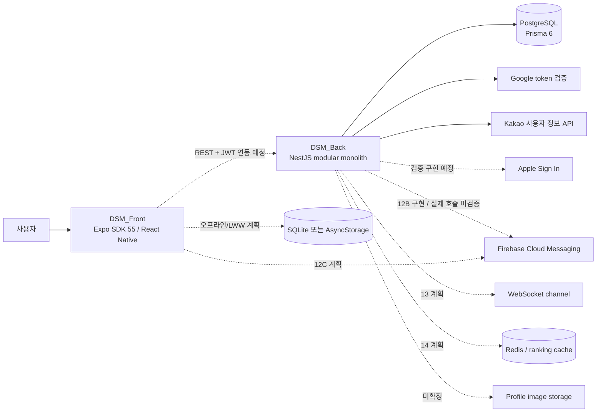
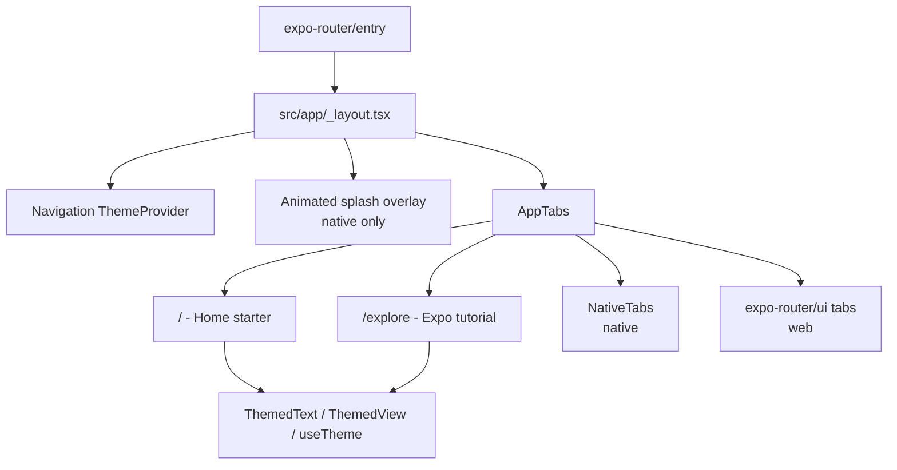
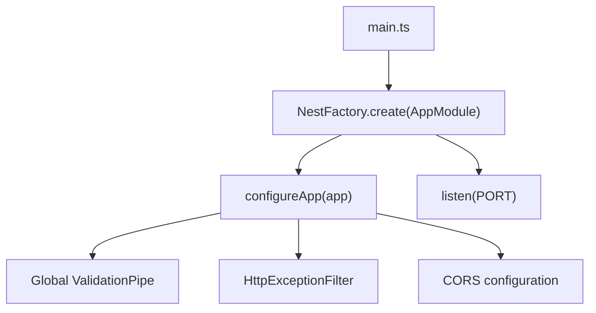
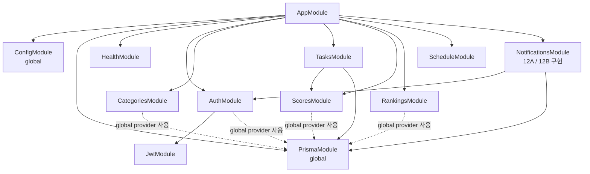
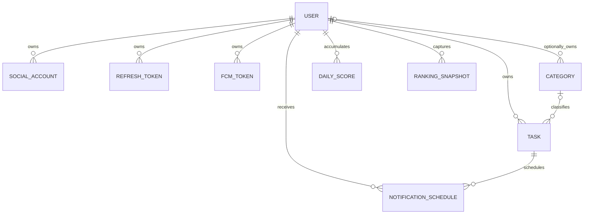
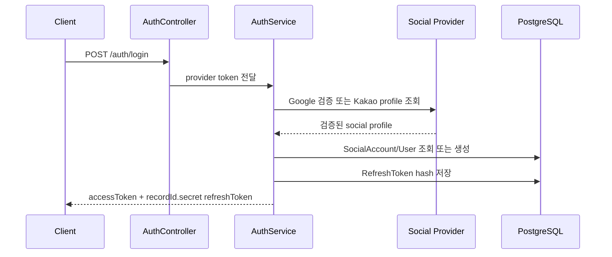
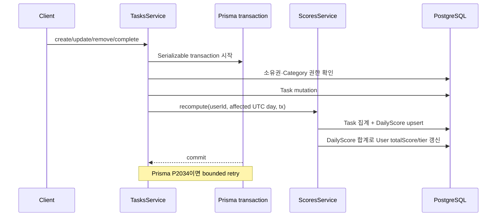

# DSM 현재 프로젝트 전체 아키텍처

> 기준일: 2026-07-15
>
> 기준 저장소: `C:\DEV` 현재 checkout
> 문서 성격: 목표 설계가 아니라 **현재 구현을 우선하는 아키텍처 스냅샷**

## 1. 문서 목적과 판정 기준

DSM(Daily Schedule Managements)은 일과 관리, 점수·티어, 전체 사용자 랭킹과 정각 알림을 결합하는 모바일 서비스다. 이 문서는 저장소의 백엔드, 프런트엔드, 데이터, 외부 연동, 운영 구조를 한곳에서 설명한다.

기존 `Planing Document/*_v1.3.md`는 목표 아키텍처를 설명하지만 현재 코드보다 앞선 항목이 많다. 따라서 이 문서는 다음 우선순위로 사실을 판정한다.

1. 현재 소스·설정·Prisma schema와 현재 Git diff
2. `.ai/memory/`의 승인·진행 상태
3. 기능별 상세 계획과 기존 v1.3 기획 문서

상태 표기는 다음과 같다.

| 상태 | 의미 |
|---|---|
| **구현됨** | 현재 소스에 연결되어 있고 기존 검증 기록이 있는 기능 |
| **진행 중** | 현재 작업 트리에 구현 중이지만 완료·회귀 검증이 확정되지 않은 기능 |
| **계획됨** | 기획 또는 후속 계획에만 있으며 현재 런타임에는 없는 기능 |
| **미확정** | 기술 선택이나 운영 계약이 아직 저장소에서 결정되지 않은 항목 |

## 2. 현재 상태 요약

| 영역 | 현재 상태 | 핵심 판정 |
|---|---|---|
| 백엔드 | **구현됨** | NestJS 11 기반 modular monolith. Auth, Category, Task, DailyScore, Ranking REST API와 PostgreSQL/Prisma 계층이 있다. |
| 프런트엔드 | **구현됨(플랫폼 셸)** | Expo SDK 55, Expo Router, native/web 2탭, splash·theme·platform 분기까지만 있다. DSM 제품 화면과 API 연동은 없다. |
| 데이터 모델 | **구현·로컬 적용됨** | Prisma schema와 Branch A 초기 migration에 사용자, 인증, 일과, 점수, 랭킹, FCM token, 알림 예약·device별 delivery 모델이 있다. 지속형 로컬 PostgreSQL에 migration을 적용했고 live schema parity를 확인했다. |
| 알림 12A | **구현됨** | FCM token 수명주기와 Task-`NotificationSchedule` 동기화가 구현됐다. 현재 12B를 포함한 백엔드 전체 검증은 Jest 22 suites·198 tests와 TypeScript를 통과한다. |
| 알림 12B | **구현·로컬 기동 검증됨** | per-device `NotificationDelivery`, Firebase ADC provider, 30초 Cron dispatcher, retry·lease·token revoke를 구현했다. Auth/JWT module DI를 복구해 AppModule compile과 기존 e2e가 통과하며, 실제 Firebase 호출은 별도 gate다. |
| 실시간/캐시 | **계획됨** | WebSocket, Redis, 랭킹 batch, 자동 snapshot은 현재 런타임에 없다. |
| 로컬 DB 실행 | **구축·검증 완료** | Docker Desktop 4.82.0, Engine·CLI 29.6.1, Compose 5.3.0, WSL 2.7.10 위에서 PostgreSQL 17 컨테이너가 `healthy`다. `127.0.0.1:5432`와 `dsm-back-postgres-data` named volume만 사용한다. |
| 배포/운영 | **미확정** | 로컬 개발 DB Compose만 있으며 백엔드 image, CI/CD, 환경별 배포 manifest와 관측성 구성은 없다. |

핵심적으로 현재 시스템은 **백엔드 도메인 API가 먼저 구현된 상태**이며, 프런트는 아직 그 API를 소비하지 않는다. 따라서 현재 checkout만으로는 계획된 DSM 사용자 여정을 end-to-end로 실행할 수 없다.

## 3. 저장소 구조

```text
C:\DEV
├─ .ai/
│  ├─ system_prompt.md        # 작업·승인·검증 운영 SSOT
│  ├─ memory/                 # 계획, 결정, 진행 상태
│  ├─ agents/                 # 역할별 서브 에이전트 계약
│  └─ docs/                   # 현재 작업 계획과 아키텍처 산출물
├─ DSM_Back/                  # NestJS + Prisma 백엔드
│  ├─ compose.yaml            # 지속형 로컬 PostgreSQL 17 개발 DB
│  ├─ prisma/schema.prisma    # PostgreSQL 데이터 계약
│  ├─ prisma/migrations/      # Branch A 초기 migration과 provider lock
│  ├─ src/
│  │  ├─ auth/ categories/ tasks/
│  │  ├─ scores/ rankings/ notifications/
│  │  ├─ config/ prisma/ health/ common/
│  │  └─ main.ts, app.bootstrap.ts, app.module.ts
│  └─ test/                   # e2e 환경과 smoke test
├─ DSM_Front/                 # React Native + Expo Router 프런트
│  ├─ src/app/                # 파일 기반 route
│  ├─ src/components/         # 공통·플랫폼별 UI
│  ├─ src/hooks/ constants/ types/
│  └─ app.json, package.json
├─ Planing Document/          # v1.3 요구사항·IA·목표 아키텍처
└─ docs/superpowers/plans/    # 완료 기능별 구현 계획
```

이 저장소는 별도 package workspace를 구성한 monorepo 도구가 아니라, 하나의 Git 저장소 안에 독립 Node 프로젝트인 `DSM_Back`과 `DSM_Front`를 나란히 둔 구조다.

## 4. 시스템 컨텍스트



실선은 현재 실행 검증된 백엔드 연동이고, 점선은 목표 설계·후속 마일스톤 또는 코드 경계만 구현되고 실제 외부 호출은 검증하지 않은 연동이다. 프런트에서 백엔드로 향하는 REST 연결도 아직 구현되지 않았으므로 점선이다.

## 5. 프런트엔드 아키텍처

### 5.1 런타임과 진입점

- React 19.2, React Native 0.83.6, Expo SDK 55를 사용한다.
- `expo-router/entry`가 애플리케이션 entry이며 `src/app`의 파일 구조가 route가 된다.
- `app.json`은 portrait, `dsmfront` scheme, 자동 light/dark, 정적 web output, typed routes와 React Compiler를 활성화한다.
- 현재 route는 `/`와 `/explore`뿐이다.

### 5.2 현재 화면·컴포넌트 구조



현재 실제 사용자 흐름은 `앱 실행 → native splash 애니메이션 → Home 또는 Explore 스타터 화면`이다. 네이티브는 `unstable-native-tabs`, 웹은 `expo-router/ui`를 사용하고 `.web.tsx` 파일 치환으로 구현을 분리한다.

UI 공통 계층은 다음만 제공한다.

- light/dark color token과 플랫폼별 font·spacing
- `ThemedText`, `ThemedView`, `useTheme`
- safe-area와 web/native layout 분기
- 애니메이션 icon과 외부 Expo 문서 링크

### 5.3 현재 없는 프런트 계층

다음 요소는 v1.3 목표에는 있으나 현재 `DSM_Front`에는 없다.

- 인증 route, JWT 저장·refresh·logout, root auth gate
- Home·Ranking·My Page의 DSM 3탭과 온보딩
- API base URL, REST client, 도메인 DTO와 오류 처리
- server state/query cache, local state store, optimistic update
- Task·Category·Score·Ranking·Profile 제품 화면
- UTC 직렬화·표시 변환 계층
- SQLite/AsyncStorage offline queue와 `updatedAt` 기반 LWW
- FCM 권한·token·local notification, WebSocket client
- 프런트 unit/component/e2e test와 EAS/release pipeline

즉, 현재 프런트는 디자인 시스템의 작은 기반과 라우팅 데모이며 백엔드 도메인 아키텍처와 아직 연결되지 않았다.

## 6. 백엔드 아키텍처

### 6.1 런타임과 bootstrap

백엔드는 NestJS 11, TypeScript, Prisma 6, PostgreSQL 기반의 단일 배포 단위다.



공통 request 경계는 다음 정책을 적용한다.

- DTO whitelist와 unknown property 거부
- class-transformer 기반 입력 변환
- validation error를 구조화된 `400` 응답으로 반환
- 모든 예외를 `statusCode`, `timestamp`, `path`, `method`, `error`, `message` 형식으로 정규화
- 환경 변수는 `ConfigModule` 시작 시 검증

### 6.2 모듈 구조



실선은 Nest module의 실제 `imports` 관계이고, 점선은 global `PrismaService` provider 사용 관계다. 각 기능은 기본적으로 `Controller → Service → PrismaService → PostgreSQL` 흐름을 따른다. 계산 규칙은 `scores.policy.ts`, `rankings.policy.ts` 같은 순수 함수 계층으로 분리해 단위 테스트한다.

### 6.3 현재 REST API 표면

| 영역 | Method | Route | 인증 | 상태·역할 |
|---|---|---|---|---|
| 기본 | GET | `/` | 없음 | 기본 응답 |
| Health | GET | `/health` | 없음 | 프로세스 상태와 DB URL 설정 여부 |
| Auth | POST | `/auth/login` | 없음 | Google/Kakao는 자체 token 발급. Apple은 현재 미설정 409 응답 |
| Auth | POST | `/auth/refresh` | refresh token | access/refresh token rotation |
| Auth | POST | `/auth/logout` | JWT | 해당 refresh token revoke, 멱등 처리 |
| Auth | GET | `/auth/me` | JWT | 검증된 JWT의 사용자 ID 반환 |
| Category | POST | `/categories` | JWT | 사용자 category 생성 |
| Category | GET | `/categories` | JWT | 사용자 소유 + 기본 category 목록 |
| Category | GET | `/categories/:id` | JWT | 소유 category 또는 기본 category 조회 |
| Category | PATCH | `/categories/:id` | JWT | 사용자 category 수정 |
| Category | DELETE | `/categories/:id` | JWT | 사용자 category 삭제 |
| Task | POST | `/tasks` | JWT | 일과 생성 |
| Task | GET | `/tasks?date=YYYY-MM-DD` | JWT | 입력 시각부터 24시간 목록. 날짜 전용 문자열이면 UTC day 범위 |
| Task | GET | `/tasks/:id` | JWT | 사용자 소유·미삭제 일과 조회 |
| Task | PATCH | `/tasks/:id` | JWT | 일과 수정 |
| Task | DELETE | `/tasks/:id` | JWT | soft delete |
| Task | PATCH | `/tasks/:id/complete` | JWT | 완료 상태 전환 |
| Score | GET | `/scores?date=YYYY-MM-DD` | JWT | 일별 점수 조회 |
| Score | GET | `/scores/summary` | JWT | 누적 점수·tier 조회 |
| Ranking | GET | `/rankings?period=` | JWT | DAILY/WEEKLY/TOTAL 내 순위 |
| Ranking | GET | `/rankings/leaderboard?period=&limit=` | JWT | TOP-N, 최대 100 |
| Ranking | POST | `/rankings/snapshot` | JWT | 현재 순위 snapshot 저장 |
| Notification | PUT | `/notifications/fcm-tokens` | JWT | token 등록·갱신·재활성화·소유권 이전, 민감 token 비노출 |
| Notification | DELETE | `/notifications/fcm-tokens` | JWT | 현재 사용자의 active token을 멱등 soft revoke |

보호 route는 body의 user ID를 신뢰하지 않고 `JwtAuthGuard`가 해석한 `req.user.sub`를 service에 전달한다. Guard는 Bearer JWT를 `JWT_ACCESS_SECRET`으로 검증하고 payload의 `type`이 `access`인지도 확인한다.

## 7. 데이터 아키텍처

### 7.1 데이터 모델 관계



| 모델 | 책임과 주요 제약 |
|---|---|
| `User` | nickname unique, 누적 `totalScore`, 6단계 `tier`, 알림 전역 플래그와 모든 사용자 종속 데이터의 root |
| `SocialAccount` | provider + provider user ID unique. 사용자 삭제 시 cascade |
| `RefreshToken` | 원문 대신 bcrypt hash 저장. record ID가 포함된 opaque token으로 O(1) 조회. revoke·expiry 보존 |
| `FcmToken` | token global unique, platform/device/user, `lastSeenAt`, soft revoke. 12A 수명주기 대상 |
| `Category` | owner인 `userId`는 optional이고 기본 여부는 `isDefault=true`로 판정한다. 사용자별 name unique. 삭제 시 Task category는 `SetNull` |
| `Task` | UTC `startAt/endAt`, difficulty/status, 알림 flag, category, soft delete와 notification schedule 관계 |
| `DailyScore` | 사용자+UTC 날짜 unique, 등록/완료 수·원점수·보정점수·상한점수·달성률 저장 |
| `RankingSnapshot` | period별 rank·percentile·score의 시점 기록. 자동 batch는 아직 없음 |
| `NotificationSchedule` | Task별 예정 시각과 `PENDING|PROCESSING|SENT|FAILED|CANCELLED`, 발송·실패 이력. 12B dispatcher가 aggregate 상태를 소유 |
| `NotificationDelivery` | schedule·FCM token별 발송 상태, retry 시각·attempt·processing lease·sanitized 실패 사유를 보존하는 per-device delivery |

모든 업무 timestamp는 PostgreSQL `timestamptz`를 사용하고 일별 집계 key인 `DailyScore.scoreDate`만 date를 사용한다. 애플리케이션의 날짜 범위와 랭킹 기간도 UTC day를 기준으로 계산한다.

### 7.2 주요 무결성·index

- `SocialAccount(provider, providerUserId)` unique
- `Category(userId, name)` unique
- `DailyScore(userId, scoreDate)` unique
- `FcmToken.token`, `RefreshToken.tokenHash` unique
- Task 조회를 위한 `(userId, startAt)`, offline 목표를 위한 `(userId, updatedAt)` index
- 랭킹을 위한 `(scoreDate, cappedScore)`와 snapshot period/time/rank index
- 알림 worker 후보 조회를 위한 `(scheduledAt, status)` index
- delivery retry 후보 조회를 위한 `(status, nextAttemptAt)` index
- stale delivery lease 회수를 위한 `(status, processingStartedAt)` index

PostgreSQL unique 제약은 nullable `Category.userId` 행끼리의 중복을 자동 차단하지 않는다. 또한 schema에는 `userId=null`과 `isDefault=true`의 동치를 강제하는 check constraint가 없으므로, 기본 Category의 생성·중복 정책은 별도 seed·운영 규칙이 필요하다.

`NotificationSchedule`에는 Task별 active schedule을 강제하는 unique 제약이 없다. application transaction이 기존 `PENDING|PROCESSING` schedule·delivery를 취소한 뒤 필요하면 새 PENDING schedule을 만들지만, 실제 병렬 DB 검증 전에는 구조적으로 완전한 단일성을 보장한다고 볼 수 없다.

## 8. 주요 런타임 흐름

### 8.1 소셜 로그인과 token 발급



- access token TTL은 15분, refresh token TTL은 30일이다.
- Google은 configured client ID를 audience 검증에도 사용한다.
- Kakao는 provider API에서 사용자 정보를 조회한다.
- Apple은 provider 분기 구조만 있고 현재 요청은 `ConflictException`으로 종료한다. 실제 token 검증은 미구현이다.

refresh는 `<recordId>.<secret>`에서 ID를 추출해 primary key 한 건만 조회하고 bcrypt 비교를 한 번 수행한다. rotation은 아직 revoke되지 않고 만료되지 않은 record에 대한 조건부 갱신과 replacement token 생성을 같은 transaction에 두어 동시 재사용의 단일 승자를 보장한다.

### 8.2 Task 변경과 DailyScore 동기화



Task create/update는 사용자 소유 category 또는 기본 category만 허용한다. 타 사용자·미존재 category는 정보 노출을 줄이기 위해 NotFound로 처리한다. Task는 soft delete되며 점수 집계에서 제외된다.

점수 정책은 다음과 같다.

- difficulty: LOW 10, MEDIUM 20, HIGH 30
- 달성률 multiplier: 100% 1.5, 80% 이상 1.3, 60% 이상 1.0, 그 미만 0.7
- 일일 상한: 900
- `DailyScore` upsert 후 모든 일별 capped score 합으로 `User.totalScore`와 tier를 재계산

기획의 일일 Task 20개 제한은 아직 구현되지 않았다.

### 8.3 Ranking 조회

- DAILY: 현재 UTC day의 `DailyScore.cappedScore`
- WEEKLY: 최근 7개 UTC day의 capped score 합
- TOTAL: `User.totalScore`
- `rank = higher users + 1`, `percentile = rank / total users × 100`
- activity가 없는 사용자를 포함한 전체 사용자 수를 분모로 사용한다.

현재는 request마다 PostgreSQL을 조회해 계산한다. `RankingSnapshot` 저장 endpoint는 있지만 자동 snapshot, batch 계산, Redis cache와 WebSocket broadcast는 없다.

### 8.4 알림 12A 완료와 12B change-gate 종료

12A의 현재 계약은 다음과 같다.

1. JWT 사용자가 FCM token을 등록·동일 사용자 갱신·재활성화·soft revoke한다. 이미 다른 사용자에게 귀속된 token/FID 등록은 409로 거부하며 in-place 소유권 이전을 허용하지 않는다.
2. Task가 미래의 PENDING 상태이며 `notificationEnabled=true`일 때 `startAt`과 같은 UTC `scheduledAt`의 PENDING schedule을 만든다.
3. Task 시간·알림·상태 변경, 완료, 삭제 시 기존 `PENDING|PROCESSING` schedule과 delivery를 CANCELLED로 전환하고 필요하면 새 schedule을 만든다.
4. Task, schedule, score 재계산을 일관된 transaction 경계에서 처리한다.

12A는 단위·회귀 검증을 완료했다. 로컬 PostgreSQL schema parity는 확인했지만 실제 병렬 transaction과 nested write 동시성은 여전히 운영 전 검증 대상이다.

12B는 branch A, 즉 비어 있거나 초기화 가능한 DB에 전체 schema를 첫 migration으로 만드는 전략으로 승인됐다. per-device delivery 확장과 지속형 로컬 개발 DB 적용도 2026-07-19 승인됐다. 현재 완료된 범위는 다음과 같다.

- Node `>=22`, `firebase-admin@14.1.0`, `@nestjs/schedule@6.1.3` package 계약
- `FCM_DISPATCH_ENABLED` 기본 false와 활성 시 `FCM_PROJECT_ID` 필수 검증
- inline client email/private key 제거와 ADC(Application Default Credentials) 전용 계약
- `change-gate`의 동시성·상태 무결성 및 Firebase·privacy 사전 조사
- `NotificationDelivery` schema와 전체 Branch A 초기 migration SQL
- retry due·stale lease 분리 index와 PostgreSQL migration provider lock
- PostgreSQL 17, UTC, loopback port, healthcheck와 persistent named volume을 사용하는 로컬 Compose
- Git에서 제외되고 backend 환경 계약을 통과한 로컬 `.env`
- 초기 migration 적용, live schema zero-drift, 10개 application table·12개 FK action과 delivery index query plan 검증
- 동일 named volume을 유지한 컨테이너 재시작과 marker 생존·정리 검증
- 기존 Firebase default app의 project identity를 검증하는 ADC provider와 기본 비활성 dispatch gate
- 매 30초 실행하며 tick당 schedule 100개, batch당 delivery 500개를 제한하는 dispatcher
- 짧은 Serializable transaction의 schedule materialize·delivery claim과 외부 transaction 밖 FCM multicast 호출
- 5분 lease·60초 heartbeat, claimId 조건부 finalization, 최대 3회 실패 응답 기반 attempt accounting
- device별 mixed outcome 영속화, `Retry-After` 우선 재시도, invalid token soft revoke와 schedule aggregate
- 외부 send 직전 durable `sendStartedAt`, terminal `UNKNOWN`과 at-most-once recovery. pre-send stale claim만 회수하고 post-send 불명확 결과는 자동 재시도하지 않는다.
- notification/title/body/Task·schedule·user 식별자를 포함하지 않는 data-only `REMINDER_SYNC`·version payload
- Android TTL 0·collapse key와 APNs expiration 0·background collapse 설정
- cross-user token/FID 소유권 이전 전면 거부와 발송 직전 owner·snapshot 재검증

두 번째 재부팅 뒤 Docker Engine을 기동했고, 오래된 AF_UNIX runtime socket은 삭제하지 않고 `.stale-*` 이름으로 보존한 뒤 새 socket을 생성하도록 복구했다. PostgreSQL 17 컨테이너는 `healthy`, restart policy는 `unless-stopped`, publish 주소는 loopback 전용이다. 초기 migration과 `20260720_notification_delivery_outcome_policy` migration을 적용했다. `prisma migrate status`, datasource-to-datamodel diff가 통과했고 `sendStartedAt`이 nullable `timestamptz(6)`인 실제 catalog와 기존 FK·index `EXPLAIN ANALYZE`를 확인했다. 재시작 전후 marker가 같은 named volume에서 유지됨도 확인했다.

12B 통합 중 12B 이전부터 존재한 Auth module 경계 결함을 발견했다. `AuthModule`이 `JwtModule`을 export하고 보호된 Scores·Categories·Rankings·Tasks module이 `AuthModule`을 명시적으로 import하도록 수정했으며, metadata-only root test에 실제 AppModule DI compile·close 회귀 검증을 추가했다. 직접 compile, 기존 e2e 2 tests와 독립 fix-recheck가 모두 통과해 `F-014` P1은 `RECHECKED`됐다.

2026-07-20 사용자는 F-004/F-010 수정과 F-007 완화 후 잔여 위험 수용 정책을 승인했다. F-004는 post-marker 장애·stale·SDK throw·heartbeat failure·응답 누락이 `UNKNOWN`으로 종결되고 명시적 per-device transient 응답만 retry하도록 수정해 독립 `RECHECKED`됐다. F-010은 cross-user token/FID 등록을 mutation 전 409로 거부하고 외부 payload를 account-neutral sync 신호로 바꿔 독립 `RECHECKED`됐다. F-007은 send 시작 뒤 recall 불가와 12C client가 표시를 결정한 직후 Task가 취소되는 좁은 race만 사용자 `ACCEPTED_RISK`로 기록했다. 12C authenticated current-state fetch/display가 아직 없으므로 실제 dispatch는 계속 기본 비활성이다.

후속 범위는 다음과 같다.

- 실제 ADC·FCM sandbox: 별도 test project·test device에서 provider 초기화, error/Retry-After 노출과 전달 계약 검증
- 12C: 모바일 권한, token 획득·refresh, logout/account switch 시 기존 Installation 삭제와 새 token/FID 등록, authenticated current-state fetch 뒤 local/foreground 알림 표시
- 13: 인증 WebSocket gateway, 알림·점수·랭킹 event와 중복 방지 event ID
- 14: Redis, 랭킹 batch, 자동 snapshot, 다중 instance lock

## 9. 횡단 관심사

### 9.1 인증·권한

- JWT access token의 `sub`를 사용자 경계로 사용한다.
- Refresh token 원문은 DB에 저장하지 않고 bcrypt hash만 저장한다.
- Category와 Task는 사용자 소유권을 service에서 검사한다.
- FCM token 원문은 식별자이자 민감 데이터로 취급해 API 응답에 다시 노출하지 않는 것이 12A 계약이다.

### 9.2 환경 변수와 외부 신뢰 경계

필수 설정은 `DATABASE_URL`, JWT secret, Google client ID이며 FCM·Redis 설정은 현재 선택적 자리만 있다. 로컬 개발값은 Git에서 제외된 `DSM_Back/.env`에 두고 Compose와 Nest 설정이 함께 읽는다. 비밀값은 문서·로그·Git 추적 파일에 기록하지 않는다.

현재 실행 검증된 외부 호출은 Google token 검증과 Kakao profile 조회다. Firebase 호출 경계는 구현됐지만 `FCM_DISPATCH_ENABLED=false`가 기본이며 실제 ADC·FCM 네트워크 검증은 하지 않았다. Apple, Redis, image storage도 현재 운영 경계에 연결되지 않았다.

### 9.3 시간과 transaction

- 서버·DB 업무 시간은 UTC가 기준이다.
- 점수 일자와 주간 ranking window는 UTC day 경계를 사용한다. Task 목록은 문서화된 `YYYY-MM-DD` 입력이면 UTC day가 되지만, DTO가 임의 ISO timestamp도 허용하고 service가 해당 시각부터 24시간을 조회하므로 동일한 자정 정규화를 항상 보장하지는 않는다.
- Task mutation과 점수 재계산은 동일 Serializable transaction이며 P2034를 제한적으로 재시도한다.
- token 등록·동일 사용자 갱신과 알림 schedule·delivery claim/finalization은 짧은 Serializable transaction과 제한된 P2034 재시도를 사용한다. cross-user token ownership 변경은 거부하며 외부 FCM 호출은 transaction에 포함하지 않는다.
- 로컬 PostgreSQL schema 적용 상태는 검증했지만 실제 병렬 transaction 경합은 unit mock과 단일 DB probe만으로 검증되지 않는다.

### 9.4 오류 응답과 CORS

- 모든 HTTP 예외는 공통 filter가 동일한 envelope로 변환한다.
- validation은 unknown field를 거부하고 DTO 입력을 변환한다.
- 현재 CORS는 broad origin 허용과 credentials 조합이므로 production 배포 전 명시 allowlist가 필요하다.
- exception filter의 500 logging·trace·correlation ID와 readiness용 실제 DB probe는 아직 없다.

## 10. 테스트와 검증 구조

### 10.1 백엔드

- Jest unit spec이 controller, service, policy, config, Prisma wrapper, health를 기능 가까이에 둔다.
- `test/set-env.ts`가 unit/e2e의 결정적 환경 변수를 제공한다.
- `test/app.e2e-spec.ts`가 health와 공통 오류 형식을 확인한다.
- test 환경의 `PrismaService`는 실제 DB 연결을 열지 않는다.
- 현재 소스에는 root, config, Prisma, health, Auth, Category, Task, Score, Ranking, Notification을 포괄하는 unit spec이 있다.
- 현재 백엔드 Jest 22 suites·198 tests, 기존 e2e 1 suite·2 tests, direct AppModule compile, TypeScript, Prisma validation, 변경 파일 non-fix ESLint·Prettier와 `git diff --check`가 통과했다.
- 전체 non-fix ESLint에는 이번 변경 밖의 기존 `auth.service.ts`, `auth.service.spec.ts` Prettier 오류 5건이 남아 있다.

12B worker와 Firebase provider는 unit mock으로 검증했고 AppModule DI compile과 기존 e2e 초기화도 통과했다. 실제 Firebase 호출은 하지 않았으며 초기 migration과 schema parity도 지속형 로컬 PostgreSQL까지만 검증했다.

### 10.2 프런트엔드

- TypeScript strict와 CSS module type declaration은 있다.
- unit/component/e2e test script와 test file은 없다.
- 실제 iOS/Android/Web build, 접근성, 반응형, native tab 동작은 이 문서화 작업에서 실행하지 않았다.

## 11. 배포·운영 아키텍처

목표 문서는 NestJS 장기 실행 server를 Render, Railway, AWS ECS 같은 VPS/PaaS 또는 container 환경에 배치하고 PostgreSQL을 Supabase/Neon 등에 둘 수 있다고 설명한다. 현재 저장소의 `compose.yaml`은 named volume을 사용하는 로컬 PostgreSQL 개발 DB만 정의하며 백엔드 애플리케이션 배포 구성은 아니다. 다음 운영 구성은 여전히 없다.

- 백엔드 Dockerfile·운영 Compose·Kubernetes/ECS manifest
- CI/CD workflow와 environment promotion 정책
- EAS build/store release 설정
- 환경별 프런트 API URL 주입
- production migration 적용 절차
- structured logging, metrics, trace, alerting
- DB connectivity readiness, backup/restore와 disaster recovery 계약

따라서 provider와 비용은 확정 아키텍처가 아니라 후보다. 현재 정의된 실행 단위는 NestJS 로컬 프로세스, Expo 개발 런타임과 실제 기동 중인 Compose 기반 로컬 PostgreSQL이다.

## 12. 목표 대비 구현 상태 매트릭스

| 기능/계층 | 상태 | 현재 근거 | 다음 의존성 |
|---|---|---|---|
| NestJS bootstrap·validation·error·health | 구현됨 | `main.ts`, `app.bootstrap.ts`, `health/` | production CORS, logging, readiness |
| PostgreSQL/Prisma model | 구현·로컬 적용됨 | `prisma/schema.prisma`, `prisma/migrations/`, live migration status·zero drift | 원격·운영 migration 절차 |
| Social JWT Auth | 구현됨/부분 | Google·Kakao, access/refresh, guard | Apple 검증, 프런트 secure session |
| Category CRUD | 구현됨 | controller/service/spec | 프런트 category UI |
| Task CRUD·완료·soft delete | 구현됨 | controller/service/spec | 20개 제한, 프런트 calendar/task UI |
| DailyScore·tier | 구현됨 | policy/service/controller/spec | 운영 검증, UI 시각화 |
| Ranking·snapshot | 구현됨 | live read + manual snapshot | batch/Redis/automatic snapshot/WS |
| FCM token·schedule 12A | 구현됨 | notifications/task/AppModule, 로컬 DB parity | 실제 병렬 transaction 검증 |
| Firebase 발송·Cron 12B | 구현·change-gate 종료 | ADC provider, 30초 Cron, at-most-once per-device delivery, account-neutral data-only sync, 22 suites·198 tests, e2e 2 tests, F-004/F-010 `RECHECKED`, F-007 `ACCEPTED_RISK` | 실제 ADC·FCM sandbox, 12C 전까지 dispatch 비활성 |
| 모바일 알림 12C | 계획됨 | 권한·FCM installation 수명주기·authenticated sync/display 미구현 | secure session·API client, 12B data-only 계약 |
| WebSocket 13 | 계획됨 | package·gateway·client 없음 | event/auth/idempotency 계약 |
| Redis·batch 14 | 계획됨 | dependency·runtime 없음 | ranking 부하·운영 요구 확정 |
| DSM 프런트 제품 화면 | 계획됨 | 현재 Expo starter 2 route | auth/API/state 기반 |
| Offline/LWW | 계획됨 | client 저장소·sync API 없음 | online mutation contract 안정화 |
| 로컬 PostgreSQL container | 구축·검증 완료 | `healthy` PostgreSQL 17, named volume, loopback port, restart persistence | backup/restore·운영 DB 절차 |
| App container/CI/CD/observability | 미확정 | 애플리케이션 배포 설정 없음 | 배포 provider·SLO 결정 |

## 13. 권장 의존 순서

현재 구조에서 다음 순서가 의존 관계를 가장 적게 꼬이게 한다.

1. 프런트 API base URL·공통 response/error DTO·secure JWT session과 root auth gate
2. Task·Category·Score·Ranking REST client와 query/cache·UTC 계층 구축
3. 12C mobile FCM permission, logout/account-switch Installation rotation, authenticated current-state sync와 local/foreground display 구현
4. 별도 sandbox 자격증명과 test device로 실제 ADC 초기화·FCM 오류/`Retry-After`·data-only 전달을 검증한 뒤에만 dispatch 활성화를 검토
5. 온라인 계약 안정화 후 offline queue/LWW 구현
6. WebSocket event contract와 Redis/batch를 실제 부하·SLO 근거에 따라 도입
7. App container/CI/CD/migration/observability를 production 배포 gate로 완성

## 14. 미확정 사항과 주요 위험

- 로컬 PostgreSQL migration·schema parity는 검증했지만 원격·운영 DB migration, backup/restore와 장애 복구 절차는 아직 없다.
- per-device dispatcher의 retry·lease 상태 전이는 구현·unit 검증됐지만 실제 병렬 PostgreSQL worker와 Firebase 호출은 검증하지 않았다.
- Firebase Admin SDK가 `Retry-After` metadata를 호출자에게 노출하는지 실제 runtime에서 검증되지 않았다.
- at-most-once 정책 때문에 marker 이후 결과가 불명확하면 delivery가 `UNKNOWN`으로 종결되어 reminder가 누락될 수 있다.
- FCM send 시작 뒤 recall 불가와 client 표시 결정 직후 Task 취소 race는 사용자 `ACCEPTED_RISK`다. 12C authenticated current-state display가 구현·검증되기 전에는 dispatch를 활성화하지 않는다.
- cross-user token/FID 이전은 거부하지만 12C logout/account-switch Installation rotation과 실제 device 검증은 아직 없다.
- 프런트의 API client, secure storage, query/state library와 feature directory 구조가 미결정이다.
- Apple token 검증, FCM credential, Redis provider, image storage provider가 미확정이다.
- offline LWW는 목표만 있고 conflict API와 삭제 tombstone 계약이 없다.
- WebSocket event schema, 인증, 재연결, replay·중복 방지 계약이 없다.
- 랭킹 live query의 실제 부하 측정과 index query plan 근거가 없다.
- profile CRUD·image upload, 회원 탈퇴, notification 전역 설정 등 목표 IA의 일부 backend API가 없다.

## 15. 근거 문서와 코드 진입점

### 현재 구현

- `DSM_Back/src/main.ts`
- `DSM_Back/src/app.bootstrap.ts`
- `DSM_Back/src/app.module.ts`
- `DSM_Back/src/auth/`
- `DSM_Back/src/categories/`
- `DSM_Back/src/tasks/`
- `DSM_Back/src/scores/`
- `DSM_Back/src/rankings/`
- `DSM_Back/src/notifications/`
- `DSM_Back/prisma/schema.prisma`
- `DSM_Front/src/app/`
- `DSM_Front/src/components/`
- `DSM_Front/src/constants/theme.ts`
- `DSM_Back/package.json`, `DSM_Front/package.json`, `DSM_Front/app.json`

### 승인·계획·목표

- `.ai/memory/plan.md`
- `.ai/memory/context.md`
- `.ai/memory/checklist.md`
- `.ai/docs/2026-07-10-milestone-12a-notification-foundation.md`
- `Planing Document/DSM_Docu_v1.3.md`
- `Planing Document/Information_Architecture_v1.3.md`
- `Planing Document/Requirements_Analysis_v1.3.md`
- `Planing Document/System_Architecture_v1.3.md`
- `docs/superpowers/plans/2026-06-01-dsm-back-foundation-prisma.md`
- `docs/superpowers/plans/2026-06-06-dsm-refresh-token-lookup.md`
- `docs/superpowers/plans/2026-06-07-dsm-daily-score.md`
- `docs/superpowers/plans/2026-06-07-dsm-rankings.md`

이 문서는 12A 완료, 12B per-device migration·지속형 로컬 DB·Firebase provider·Cron dispatcher 구현, Auth/JWT DI 복구와 로컬 AppModule·e2e 검증, 실제 Firebase 미검증까지 반영한다.
