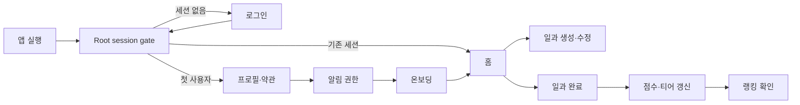

# DSM 프런트엔드 페이지·기능·인터랙션 요구사항

- 문서 버전: 1.0
- 작성일: 2026-07-19
- 대상: `DSM_Front` React Native + Expo Router 클라이언트
- 상태: 구현 전 요구사항 기준선
- 범위: 화면, 기능, 데이터/API, UI 상태, 애니메이션, 접근성, 성능, 보안, 테스트, 구현 우선순위

## 1. 문서 목적

이 문서는 DSM(Daily Schedule Managements) 모바일 앱의 프런트엔드 제품 화면을 구현하기 위한 통합 요구사항이다. 기존 기획의 화면 구조와 기능 요구사항을 현재 백엔드 API 및 실제 Expo starter 구현과 대조해 다음을 명확히 한다.

- 어떤 화면이 필요한가
- 각 화면에서 사용자가 무엇을 할 수 있어야 하는가
- 어떤 API와 데이터가 필요한가
- loading, empty, error, offline, 권한 거부 같은 비정상 상태를 어떻게 처리하는가
- 어떤 애니메이션과 haptic feedback을 어떤 목적으로 사용하는가
- 현재 구현 가능한 범위와 백엔드 또는 후속 마일스톤이 필요한 범위는 무엇인가
- MVP부터 후속 단계까지 어떤 순서로 구현하는가

이 문서는 화면 구현의 요구사항 기준선이며, package 설치, 제품 코드 수정, 백엔드 API 추가 또는 디자인 시안 확정 자체를 승인하는 문서는 아니다.

## 2. 근거와 판정 원칙

### 2.1 근거 문서와 코드

- `Planing Document/Requirements_Analysis_v1.3.md`
- `Planing Document/Information_Architecture_v1.3.md`
- `Planing Document/System_Architecture_v1.3.md`
- `Planing Document/DSM_Docu_v1.3.md`
- `.ai/docs/2026-07-15-current-project-architecture.md`
- `.ai/memory/plan.md`
- `.ai/memory/context.md`
- `.ai/memory/checklist.md`
- `DSM_Front/src/app/`
- `DSM_Front/src/components/`
- `DSM_Front/package.json`
- `DSM_Front/app.json`
- `DSM_Back/src/`
- `DSM_Back/prisma/schema.prisma`

### 2.2 충돌 판정

기획 문서와 현재 코드가 다르면 다음과 같이 분리한다.

1. 현재 사용할 수 있는 API와 데이터 계약은 실제 checkout의 소스를 기준으로 한다.
2. 기획에만 존재하는 기능은 목표 요구사항으로 남기되 `추가 필요`로 표시한다.
3. 진행 중인 12B, 계획된 12C와 WebSocket 기능은 완료된 기능으로 간주하지 않는다.
4. 현재 Expo starter의 예제 화면은 제품 화면으로 간주하지 않는다.

### 2.3 상태 표기

| 상태 | 의미 |
|---|---|
| 구현 가능 | 현재 REST API와 데이터로 핵심 기능을 구현할 수 있음 |
| 부분 지원 | 일부 기능은 구현할 수 있으나 완성에 추가 API 또는 정책이 필요함 |
| 백엔드 선행 필요 | 현재 API로 핵심 기능을 제공할 수 없음 |
| 후속 마일스톤 의존 | 12B, 12C, WebSocket, offline sync 같은 후속 작업에 의존 |
| 정적 구현 가능 | 외부 API 없이 콘텐츠와 navigation만 구현 가능 |

## 3. 현재 프런트엔드 상태

현재 `DSM_Front`는 Expo SDK 55 starter 구조다.

- 실제 route는 `src/app/index.tsx`, `src/app/explore.tsx` 두 개다.
- 두 route 모두 Expo 사용법을 안내하는 예제 화면이다.
- root layout은 animated splash overlay와 2개 tab을 표시한다.
- native는 `expo-router/unstable-native-tabs`, web은 `expo-router/ui`를 사용한다.
- light/dark theme와 기본 themed component, Reanimated 기반 예제 animation은 있다.
- API client, auth session, secure token storage, server-state cache, form 계층은 없다.
- notification, social-login client, haptics, offline storage, WebSocket client는 설치되어 있지 않다.
- 프런트 unit, component, integration, E2E test는 없다.

따라서 제품 화면 구현은 starter 화면 교체와 함께 인증·API·상태 관리 기반을 먼저 세우는 작업이 필요하다.

## 4. 제품 경험 원칙

1. 핵심 행동은 `일과 확인 → 완료 체크 → 점수 변화 → 티어·랭킹 피드백`으로 이어져야 한다.
2. 일과 등록은 핵심 입력을 3번 이내의 주요 탭으로 완료할 수 있어야 한다.
3. 서버와 DB에는 UTC ISO 8601 timestamp를 보내고 화면에는 사용자 로컬 시간을 표시한다.
4. 일과 mutation은 즉시 반응하는 Optimistic UI를 사용하되 실패 시 반드시 rollback한다.
5. 애니메이션은 장식이 아니라 상태 변화, 성공, 실패, 위치 변화를 설명해야 한다.
6. 색상만으로 난이도, 완료 상태, 카테고리, 순위 상승·하락을 전달하지 않는다.
7. 실시간·알림·offline 기능이 사용할 수 없는 상태에서도 핵심 일정 관리 흐름은 설명 가능한 상태로 유지한다.
8. JWT, refresh token, FCM token은 UI, 로그, 분석 이벤트에 노출하지 않는다.

## 5. 핵심 사용자 흐름



### 5.1 첫 진입

`Splash/session gate → Login → Profile/Terms → Notification Permission → Tutorial → Home → New Task`

### 5.2 재진입

`Splash/session gate → access token 확인 → 필요 시 refresh → Home`

### 5.3 일과 완료

`Home task checkbox → optimistic complete → PATCH /tasks/:id/complete → task/score/ranking cache 재검증`

### 5.4 알림 진입

`OS push 또는 foreground notification → 인증 상태 확인 → payload taskId 검증 → task detail → 완료`

### 5.5 실시간 랭킹

`Ranking 진입 → REST 초기 데이터 → WebSocket 연결 → event deduplication → 내 순위와 목록 재배치`

WebSocket 흐름은 목표 요구사항이며 현재 서버와 클라이언트에 구현되어 있지 않다.

## 6. 전체 화면 inventory

Root session gate 1개와 15개 화면 그룹을 기준으로 한다.

| ID | 화면 | 우선순위 | 지원 상태 | 주요 의존성 |
|---|---|---:|---|---|
| SYS-00 | Root splash·session gate | P0 | 부분 지원 | secure storage, API client, auth store |
| AUTH-01 | 소셜 로그인 | P0 | 부분 지원 | Google/Kakao client, Apple 후속 |
| ONB-01 | 초기 프로필·약관 | P1 | 백엔드 선행 필요 | profile API, nickname check, 약관 원문 |
| ONB-02 | 알림 권한 | P1 | 후속 마일스톤 의존 | 12C, notification SDK |
| ONB-03 | 온보딩·튜토리얼 | P1 | 정적 구현 가능 | 로컬 완료 상태 |
| HOME-01 | 홈 대시보드 | P0 | 구현 가능 | Task, Score, Ranking REST |
| TASK-01 | 일과 생성 | P0 | 구현 가능 | Task·Category REST |
| TASK-02 | 일과 상세·수정 | P0 | 구현 가능 | Task REST |
| CAL-01 | 주간·월간 캘린더 | P1 | 부분 지원 | 날짜 범위·달성률 API 권장 |
| CAT-01 | 카테고리 관리 | P0 | 구현 가능 | Category REST |
| RANK-01 | 랭킹 | P0 | 부분 지원 | REST 가능, WebSocket 후속 |
| STAT-01 | 나의 통계 | P1 | 부분 지원 | range/category 통계 API |
| ME-01 | 마이페이지 | P0 | 부분 지원 | score summary, profile API |
| ACC-01 | 프로필·계정 관리 | P1 | 백엔드 선행 필요 | user CRUD, image, withdrawal |
| SET-01 | 알림 설정 | P1 | 백엔드·12C 필요 | global preference, OS permission |
| SUP-01 | 도움말·규칙·법적 정보 | P2 | 정적 구현 가능 | 확정 콘텐츠·URL |

## 7. 권장 Expo Router 구조

```text
DSM_Front/src/app/
├─ _layout.tsx
├─ (auth)/
│  └─ login.tsx
├─ (onboarding)/
│  ├─ profile.tsx
│  ├─ notification-permission.tsx
│  └─ tutorial.tsx
├─ (tabs)/
│  ├─ _layout.tsx
│  ├─ index.tsx
│  ├─ ranking.tsx
│  └─ me.tsx
├─ task/
│  ├─ new.tsx
│  └─ [id].tsx
├─ calendar.tsx
├─ categories.tsx
├─ stats.tsx
├─ settings/
│  ├─ profile.tsx
│  └─ notifications.tsx
├─ support.tsx
└─ legal/
   └─ [document].tsx
```

### 7.1 Navigation 정책

- root는 `Stack` 역할을 하며 session과 onboarding 상태를 기준으로 route group을 선택한다.
- 로그인 사용자의 main navigation은 `Home`, `Ranking`, `My`의 3개 tab이다.
- 일과 생성·수정은 mobile에서 modal 또는 bottom sheet presentation을 우선 검토한다.
- 캘린더, 카테고리, 통계, 설정은 tab의 하위 stack route다.
- push deep link는 `task/[id]`를 열되 인증이 끝난 뒤 실행한다.
- 존재하지 않거나 삭제된 task deep link는 Not Found 안내 후 Home으로 돌아갈 수 있어야 한다.
- 현재 사용 중인 unstable native tab은 iOS/Android/Web 동작을 검증한 뒤 유지 여부를 결정한다.

## 8. 공통 프런트엔드 기반 요구사항

### 8.1 인증과 session

- access token과 refresh token 원문을 일반 AsyncStorage에 저장하지 않는다.
- refresh token은 OS secure storage에 저장한다.
- access token은 secure storage 또는 보호된 session 계층에서 관리하고 가능한 한 memory 사용을 우선한다.
- 앱 시작 시 secure storage hydration이 끝나기 전 navigation을 확정하지 않는다.
- 401 발생 시 refresh 요청을 한 번만 실행하는 single-flight 처리가 필요하다.
- refresh 성공 시 대기 중인 요청을 새 access token으로 한 번 재시도한다.
- refresh 실패 시 token, user cache, FCM registration 상태를 정리하고 Login으로 이동한다.
- 로그아웃은 `POST /auth/logout`, FCM token revoke, local session 삭제 순서를 실패 정책과 함께 정의한다.
- provider token과 JWT 원문을 console, toast, analytics에 기록하지 않는다.

### 8.2 API client와 오류 계약

현재 백엔드 오류 envelope는 다음 형태다.

```ts
type ApiError = {
  statusCode: number;
  timestamp: string;
  path: string;
  method: string;
  error: string;
  message: string | string[] | Record<string, unknown>;
};
```

- validation `message`는 field/constraint 객체 배열이 될 수 있다.
- API client는 transport error, timeout, HTTP error, validation error, auth error를 구분한다.
- 사용자 메시지는 서버 원문 전체를 그대로 노출하지 않고 field와 행동에 맞게 매핑한다.
- retry는 GET 등 안전한 요청에 제한하고 mutation을 임의 자동 재전송하지 않는다.
- API base URL은 환경별 설정으로 주입하며 source에 하드코딩하지 않는다.

### 8.3 서버 상태와 cache

- query key는 사용자, 기능, 날짜 또는 period를 포함한다.
- 로그인 사용자가 바뀌면 이전 사용자 cache를 즉시 폐기한다.
- Home 진입 시 현재 날짜의 task, daily score, score summary, daily ranking을 병렬 조회한다.
- task mutation 성공 뒤 관련 날짜 task, daily score, score summary, ranking cache를 재검증한다.
- Ranking period 변경은 period별 cache를 분리한다.
- background에서 foreground로 돌아올 때 stale 데이터만 재검증한다.
- 무한 loading을 막기 위해 요청 timeout과 취소 처리를 지원한다.

### 8.4 시간과 날짜

- 화면에서는 device locale과 timezone으로 표시한다.
- Task create/update payload의 `startAt`, `endAt`은 UTC ISO 8601 문자열로 변환한다.
- 날짜별 조회는 `YYYY-MM-DD`를 사용해 백엔드의 UTC day 동작을 고정한다.
- 시작 시간이 종료 시간보다 빠른지 client에서 우선 검증한다.
- DST 변경이 있는 timezone에서도 date picker 선택값과 표시값이 일치해야 한다.
- 자정 경계, timezone 변경, 여행 중 device timezone 변경을 테스트한다.
- Home의 “오늘”은 기획상 UTC day와 사용자 기대의 local day가 다를 수 있으므로 제품 정책을 명시적으로 확정해야 한다.

### 8.5 Optimistic UI와 rollback

- task 완료, 생성, 수정, 삭제는 optimistic candidate지만 각 mutation별 rollback snapshot을 보관한다.
- 중복 탭은 mutation pending 동안 차단한다.
- 완료 성공 후 서버가 반환한 Task를 cache의 최종 값으로 사용한다.
- 실패 시 task, score, ranking 표시를 원래 상태로 복원하고 재시도 행동을 제공한다.
- 삭제는 즉시 목록에서 제거하되 실패 시 원래 위치에 복원한다.
- 서버 응답 전 점수의 정확한 증가값을 추정하지 않는다. 점수는 pending 표시 후 재조회 결과로 animation한다.

### 8.6 Offline와 동기화

기획은 offline task CRUD와 `updatedAt` 기반 Last-Write-Wins를 요구하지만 현재 동기화 API와 삭제 tombstone 계약이 없다.

- MVP에서는 offline read cache와 명확한 offline banner를 우선한다.
- offline mutation queue는 backend sync 계약이 확정되기 전 제품 완료로 간주하지 않는다.
- 후속 queue에는 local mutation ID, entity ID, base updatedAt, operation, payload, createdAt이 필요하다.
- 삭제 동기화를 위해 tombstone 또는 삭제 시각 계약이 필요하다.
- reconnect 시 사용자에게 동기화 진행·성공·충돌 상태를 보여야 한다.
- 같은 task의 여러 pending mutation은 안전하게 병합하거나 순서를 보존해야 한다.

### 8.7 알림과 deep link

- 로그인 또는 token refresh 후 OS permission과 push token 상태를 확인한다.
- 허용된 경우 `PUT /notifications/fcm-tokens`로 token, platform, optional deviceId를 등록한다.
- 로그아웃 시 현재 token을 `DELETE /notifications/fcm-tokens`로 revoke한다.
- token 원문은 응답 UI, log, analytics에 남기지 않는다.
- foreground notification은 in-app banner와 선택적 sound/haptic으로 표시한다.
- notification payload의 `type`, `taskId`, `scheduleId`를 allowlist 검증한다.
- 알림 탭 시 session gate를 거친 뒤 task detail로 이동한다.
- 알림 거부 사용자는 OS 설정 이동과 인앱 대체 동작을 안내한다.
- mobile notification client는 12C 범위이며 현재 구현되지 않았다.

### 8.8 공통 UI 상태

모든 데이터 화면은 다음 상태를 의도적으로 설계한다.

| 상태 | 기본 처리 |
|---|---|
| Initial loading | 화면 구조를 반영한 skeleton 사용 |
| Background refresh | 기존 콘텐츠를 유지하고 작은 refresh indicator 표시 |
| Empty | 상황 설명, 대표 행동 CTA, 장식 illustration 선택 |
| Recoverable error | 오류 요약, 재시도, 이전 데이터 유지 |
| Auth expired | 자동 refresh 후 실패 시 Login 이동 |
| Offline | 상단 banner, cache 시각, mutation 제한 또는 대기 표시 |
| Permission denied | 제한되는 기능과 OS 설정 이동 제공 |
| Mutation pending | 해당 control만 비활성화하고 중복 요청 차단 |
| Mutation failed | rollback, toast 또는 inline error, 재시도 |
| Not found | 삭제·소유권·잘못된 링크를 구분하지 않는 안전한 안내 |

## 9. 화면별 상세 요구사항

## 9.1 SYS-00 Root splash·session gate

### 목적

앱 실행 시 session, onboarding, notification deep link 상태를 복원하고 올바른 첫 route를 결정한다.

### 핵심 기능

- native splash 유지
- secure storage hydration
- access token 존재·만료 확인
- 필요한 경우 refresh
- 최초 사용자 onboarding 완료 여부 확인
- pending deep link 저장과 인증 후 재실행
- offline 재진입 정책 적용

### 데이터/API

- `GET /auth/me`: 현재는 `{ userId }`만 반환
- `POST /auth/refresh`
- local secure session
- local onboarding completion flag

### 상태·예외

- secure storage 읽기 실패
- refresh timeout 또는 401
- 네트워크 없음
- 손상된 token
- deep link의 task가 없거나 타 사용자 소유

### 애니메이션·피드백

- logo opacity/scale: 250~400ms
- session 확정 뒤 destination으로 180~240ms crossfade
- 불필요한 최소 노출 시간을 강제하지 않는다.
- reduced motion에서는 scale 없이 짧은 opacity 전환만 사용한다.

### 접근성

- splash animation이 session 처리보다 오래 화면을 막지 않아야 한다.
- screen reader가 의미 없는 logo animation을 반복 읽지 않게 한다.

### 완료 조건

- session hydration 전 Login 또는 Home이 순간 노출되지 않는다.
- refresh 성공·실패·offline 분기 테스트가 있다.
- 인증이 필요한 deep link가 session 확정 후 한 번만 실행된다.

## 9.2 AUTH-01 소셜 로그인

### 목적

Google 또는 Kakao provider token을 받아 DSM access/refresh token으로 교환한다.

### 핵심 기능

- Google 로그인
- Kakao 로그인
- Apple 로그인은 backend 검증 전 숨김 또는 “준비 중” 상태
- 약관·개인정보 링크
- provider 취소와 오류 재시도
- 로그인 성공 뒤 session 저장과 onboarding 분기

### 데이터/API

- `POST /auth/login`
- request: `{ provider: "GOOGLE" | "KAKAO" | "APPLE", token: string }`
- response: `{ accessToken, refreshToken }`

### 상태·예외

- provider popup 또는 app 전환 취소
- provider SDK 오류
- 네트워크 오류
- backend provider validation 실패
- Apple 요청의 현재 409 응답
- 중복 탭과 동시 provider 요청

### 애니메이션·피드백

- logo와 문구는 200~300ms의 한 번만 실행되는 staggered fade
- button press는 80~120ms, scale 0.98 수준
- 누른 provider button에만 spinner 표시
- 로그인 성공은 180~240ms fade transition
- 실패 시 화면 전체 shake 대신 해당 button 또는 inline error를 강조한다.

### 접근성

- provider 이름을 text로 제공한다.
- icon만으로 provider를 구분하지 않는다.
- loading 동안 `accessibilityState.busy`와 중복 실행 차단을 적용한다.

### 완료 조건

- provider 취소는 오류 toast 없이 정상 취소로 처리된다.
- token 원문이 log와 UI에 노출되지 않는다.
- Google/Kakao 성공과 실패 navigation 테스트가 있다.
- Apple은 실제 backend 지원 전 성공 경로로 노출되지 않는다.

## 9.3 ONB-01 초기 프로필·약관

### 목적

첫 로그인 사용자가 서비스에 사용할 닉네임, 선택적 이미지와 필수 약관 동의를 확정한다.

### 핵심 기능

- nickname 입력과 길이·허용 문자 검증
- nickname 중복 확인
- provider 기본 nickname 제안
- profile image 선택·crop·제거
- 필수·선택 약관 동의 분리
- 약관 상세 열기
- 완료 전 이탈 확인

### 데이터/API

현재 social login이 provider profile로 User를 자동 생성하지만 profile 조회·수정, nickname 중복 확인, image upload API는 없다.

필요 API 후보:

- `GET /users/me`
- `PATCH /users/me`
- `GET /users/nickname-availability?nickname=`
- profile image upload 또는 signed upload 계약

### 상태·예외

- nickname 중복
- image 용량·형식 오류
- upload 실패
- 필수 약관 미동의
- provider nickname이 이미 사용 중인 상태

### 애니메이션·피드백

- input validation 상태는 120~180ms color/opacity transition
- avatar 교체는 180~240ms crossfade
- nickname 사용 가능 성공은 작은 check transition
- image upload는 determinate progress를 우선한다.

### 접근성

- validation 오류는 색상과 함께 text로 제공한다.
- 약관 checkbox는 label 전체가 터치 가능해야 한다.
- profile image 편집 control에 명확한 label을 제공한다.

### 완료 조건

- backend profile 계약이 확정되기 전 mock 성공을 제품 완료로 간주하지 않는다.
- nickname 중복과 upload 실패를 field 단위로 복구할 수 있다.
- 필수 약관에 동의하지 않으면 완료할 수 없다.

## 9.4 ONB-02 알림 권한

### 목적

OS 권한 dialog 전에 알림의 목적을 설명하고 허용된 token을 서버에 등록한다.

### 핵심 기능

- 일정 알림이 필요한 이유 설명
- 허용, 나중에 하기
- OS notification permission 요청
- push token 발급·등록
- 거부 또는 제한 상태 안내
- 설정 앱 이동

### 데이터/API

- `PUT /notifications/fcm-tokens`
- `DELETE /notifications/fcm-tokens`
- notification SDK와 platform permission

### 상태·예외

- OS에서 이미 허용·거부·제한
- simulator 또는 push 미지원 환경
- token 획득 실패
- 서버 등록 실패
- 권한은 허용됐지만 token이 아직 없는 상태

### 애니메이션·피드백

- bell illustration은 주의를 방해하지 않는 짧은 1회 motion
- permission 성공은 check 200~300ms
- OS dialog 전환 중 중복 버튼 입력을 막는다.
- reduced motion에서는 정적 illustration을 사용한다.

### 접근성

- 권한 거부가 앱 사용 자체를 막지 않아야 한다.
- “나중에” 행동이 명확해야 한다.
- sound와 vibration 사용 여부를 text로 설명한다.

### 완료 조건

- 권한 상태별 화면과 token 등록 실패 복구가 있다.
- 거부 사용자가 Home으로 계속 진행할 수 있다.
- 12C 구현과 실제 device 검증 전 완료로 표시하지 않는다.

## 9.5 ONB-03 온보딩·튜토리얼

### 목적

일과 등록, 점수 산식과 일일 상한, 랭킹·티어를 짧게 설명한다.

### 핵심 기능

- 3개 내외의 tutorial page
- 다음, 이전, 건너뛰기, 시작하기
- 완료 상태 로컬 저장
- 도움말에서 다시 보기

### 콘텐츠

1. 일과 등록과 완료
2. 난이도·달성률·일일 점수 상한 900
3. 일간·주간·누적 랭킹과 6단계 tier

기획의 일일 task 최대 20개 제한은 backend에 아직 구현되지 않았으므로 “서버가 보장하는 제한”으로 표현하지 않는다.

### 애니메이션·피드백

- horizontal paging
- indicator 180~240ms 위치 전환
- illustration의 작은 parallax는 선택 사항
- swipe와 button navigation을 함께 제공
- reduced motion에서는 parallax를 제거한다.

### 완료 조건

- 건너뛰기와 마지막 완료가 동일한 completion flag를 안전하게 저장한다.
- 앱 재실행 시 완료 사용자를 tutorial로 다시 보내지 않는다.
- 도움말에서 tutorial을 다시 볼 수 있다.

## 9.6 HOME-01 홈 대시보드

### 목적

오늘의 성취 상태와 일과를 한 화면에서 확인하고 가장 짧은 경로로 완료·추가·수정한다.

### 핵심 기능

- 오늘 날짜와 사용자 로컬 시간
- 당일 점수
- 누적 점수와 tier badge
- 당일 rank 또는 상위 percentile
- 주간 날짜 strip
- 날짜별 achievement indicator
- 시간순 task timeline
- task 완료 checkbox
- task detail 진입
- 새 task FAB
- pull-to-refresh
- calendar, category, stats shortcut
- offline/sync 상태

### 데이터/API

- `GET /tasks?date=YYYY-MM-DD`
- `GET /scores?date=YYYY-MM-DD`
- `GET /scores/summary`
- `GET /rankings?period=DAILY`
- `PATCH /tasks/:id/complete`

### Task 표시 정보

- title
- start/end local time
- category name·색상
- difficulty text와 icon
- status
- notification enabled 상태
- 완료 시각 또는 완료 상태

현재 Task 응답에는 category object가 포함되지 않을 수 있으므로 category 목록과 `categoryId`를 client에서 조합하거나 backend include 계약을 추가해야 한다.

### 상태·예외

- task 없음
- score row 없음
- rank score 0
- task 완료 mutation pending
- 점수 재조회 실패
- 다른 device에서 task 변경
- offline cache
- 하루 task 20개 제한 미구현

### 애니메이션·피드백

- initial skeleton은 실제 card/timeline 구조를 반영한다.
- date 변경은 방향성 있는 160~220ms horizontal slide
- task 완료 checkbox는 짧은 spring과 optional light haptic
- 완료된 title은 160~220ms strike-through·opacity 전환
- server score 재조회 전에는 score 영역에 pending indicator를 표시한다.
- 새 점수 확정 후 400~600ms count-up
- task 삽입·삭제·순서 변경은 layout transition
- 실제 tier 변경 때만 승급 overlay, confetti, success haptic을 1회 실행한다.

### 접근성

- checkbox label에 task title과 현재 완료 상태를 포함한다.
- category와 difficulty는 색상 외 text 또는 icon을 함께 사용한다.
- timeline 순서가 screen reader 순서와 일치해야 한다.
- FAB에 “새 일과 추가” label을 제공한다.

### 완료 조건

- task 완료 optimistic update와 rollback이 동작한다.
- 날짜 변경 시 잘못된 날짜 cache가 섞이지 않는다.
- empty, loading, error, offline 상태가 모두 존재한다.
- score·tier·ranking 재검증 범위가 테스트된다.

## 9.7 TASK-01 일과 생성

### 목적

최소한의 입력으로 새 일과를 생성한다.

### 입력

- title: 필수
- description: 선택
- startAt: 필수
- endAt: 필수
- difficulty: `LOW | MEDIUM | HIGH`
- categoryId: 선택
- notificationEnabled: 선택, 기본 true

### 핵심 기능

- 날짜·시간 picker
- title과 description 입력
- difficulty segmented control
- category 선택
- 개별 알림 toggle
- 저장
- dirty form 이탈 확인
- keyboard와 safe area 대응

### 데이터/API

- `GET /categories`
- `POST /tasks`

### 검증

- title이 비어 있지 않음
- `startAt < endAt`
- 유효한 difficulty
- category는 사용자 소유 또는 default
- 날짜·시간을 UTC ISO로 변환
- 일일 20개 제한은 backend 구현 후 client에 동일 안내 추가

### 애니메이션·피드백

- modal/bottom sheet 진입: 250~350ms
- difficulty/category 선택: 120~180ms selection transition
- notification 부가 설명: 160~220ms expand/collapse
- save pending: button 내부 spinner와 중복 요청 차단
- 성공: Home optimistic insert 후 180~240ms dismiss

### 접근성

- picker에 선택 날짜와 timezone을 읽을 수 있는 label 제공
- difficulty를 색상으로만 표시하지 않는다.
- validation 오류를 해당 field와 연결한다.

### 완료 조건

- 주요 입력 3단계 이내 완료가 가능하다.
- 저장 실패 시 입력값을 잃지 않는다.
- UTC payload와 local display round-trip 테스트가 있다.

## 9.8 TASK-02 일과 상세·수정

### 목적

기존 일과의 상세를 확인하고 수정·완료·삭제한다.

### 핵심 기능

- task 상세 조회
- 필드 수정
- 완료
- soft delete
- 개별 알림 toggle
- category 변경
- 변경 전후 날짜가 달라지는 수정 처리
- 삭제 confirmation

### 데이터/API

- `GET /tasks/:id`
- `PATCH /tasks/:id`
- `DELETE /tasks/:id`
- `PATCH /tasks/:id/complete`

### 상태·예외

- 404: 삭제, 미존재, 타 사용자 소유를 구분하지 않는 안전한 안내
- 이미 완료된 task
- 과거 task 수정
- 다른 device의 최신 수정과 충돌
- mutation 중 deep link 재진입

### 애니메이션·피드백

- detail 진입은 platform 기본 stack transition
- edit mode 전환은 field crossfade
- delete는 destructive confirmation 후 목록 collapse
- 완료는 Home과 같은 checkbox·score feedback 원칙 사용
- rollback 시 과도한 shake 대신 inline error와 원상복구를 사용한다.

### 완료 조건

- 삭제 성공 뒤 뒤로 가기 시 stale detail이 다시 노출되지 않는다.
- 수정이 날짜를 옮기면 두 날짜의 task·score cache를 모두 재검증한다.
- 404와 mutation 실패 복구 흐름이 있다.

## 9.9 CAL-01 주간·월간 캘린더

### 목적

기간별 일과 등록 상태와 달성률을 한눈에 보고 날짜 상세로 이동한다.

### 핵심 기능

- 주간·월간 mode 전환
- 이전·다음 주/월
- 오늘 이동
- 날짜별 task 수와 achievement indicator
- 선택 날짜의 task summary
- 선택 날짜 Home 또는 task 목록으로 이동

### 데이터/API

현재 `GET /tasks?date=YYYY-MM-DD`와 `GET /scores?date=YYYY-MM-DD`는 한 날짜씩 조회한다.

권장 추가 계약:

- 날짜 범위 task 조회
- 날짜 범위 score summary
- 날짜별 registered/completed count와 achievementRate

월간 화면을 날짜별 수십 회 요청으로 구현하는 것은 최종 구조로 권장하지 않는다.

### 상태·예외

- 해당 월 데이터 없음
- 일부 날짜 요청 실패
- 월 경계와 timezone
- 미래 날짜
- offline cached month

### 애니메이션·피드백

- 이전·다음 월은 방향성 있는 horizontal transition
- 주간↔월간은 220~320ms container size transition
- 선택 날짜는 짧은 scale/indicator transition
- achievement indicator는 data 갱신 시 crossfade
- scroll 중 heavy chart animation을 반복하지 않는다.

### 접근성

- 각 날짜 cell에 날짜, task 수, 완료율을 함께 읽는다.
- indicator 색상 외 숫자 또는 상태 text 대체를 제공한다.
- swipe 외 이전·다음 button을 제공한다.

### 완료 조건

- 월간 조회가 과도한 요청을 만들지 않는 API 계약을 확보한다.
- 날짜 선택과 timezone 경계 테스트가 있다.
- 빈 달과 일부 실패 상태를 처리한다.

## 9.10 CAT-01 카테고리 관리

### 목적

기본 카테고리를 조회하고 사용자 카테고리를 추가·수정·삭제한다.

### 핵심 기능

- 기본·사용자 카테고리 분리
- name과 hex color 표시
- 새 category 생성
- 사용자 category 수정
- 사용자 category 삭제
- 기본 category read-only 표시
- 중복 name 오류

### 데이터/API

- `GET /categories`
- `POST /categories`
- `PATCH /categories/:id`
- `DELETE /categories/:id`

### 상태·예외

- default category 수정·삭제 시 403
- 중복 name 409
- 삭제 뒤 task의 category가 null이 되는 상태
- 잘못된 hex color
- empty user category

### 애니메이션·피드백

- 행 추가·삭제는 layout transition
- color swatch 선택은 100~160ms scale
- swipe action을 제공할 경우 동일 기능의 visible menu도 제공
- 삭제 성공 후 row collapse

### 접근성

- 색상 이름 또는 hex text를 함께 제공한다.
- default category의 잠금 상태를 icon과 text로 표시한다.
- destructive action은 confirmation을 거친다.

### 완료 조건

- default category가 편집 가능한 것처럼 보이지 않는다.
- 409와 403을 목적에 맞는 메시지로 표시한다.
- 삭제 후 Home/task editor category 표시가 정상 갱신된다.

## 9.11 RANK-01 랭킹

### 목적

일간·주간·누적 기준의 내 순위와 TOP 100을 제공한다.

### 핵심 기능

- `DAILY | WEEKLY | TOTAL` period tab
- 내 rank, percentile, score, totalUsers
- TOP 100 목록
- 내 사용자 row 강조
- pull-to-refresh
- REST 초기 조회
- 후속 WebSocket 실시간 갱신
- 연결 상태 안내

### 데이터/API

- `GET /rankings?period=`
- `GET /rankings/leaderboard?period=&limit=100`
- `POST /rankings/snapshot`은 제품에서 수동 호출 필요성을 별도 결정

Leaderboard 항목:

- rank
- userId
- nickname
- tier
- profileImageUrl
- score

### 상태·예외

- rank 데이터 0
- leaderboard empty
- 사용자 profile image 없음
- REST 성공 후 WebSocket 실패
- duplicate 또는 out-of-order event
- period 변경 중 이전 목록 노출

### 애니메이션·피드백

- period indicator: 180~240ms slide
- rank 숫자 변경: 300~500ms digit transition
- 순위 상승·하락: row layout transition과 방향 icon
- 실시간 변경 row는 600ms 이하의 배경 highlight 후 원상복귀
- 초기 fetch에서는 “순위 상승” animation을 실행하지 않는다.
- 실제 순위 변화에만 optional light haptic을 사용한다.

### 접근성

- “3위, 골드, 사용자명, 420점”처럼 row 전체 의미를 읽는다.
- 상승·하락을 색상과 icon만으로 전달하지 않는다.
- 긴 목록은 screen reader 순서를 유지한다.

### 완료 조건

- REST-only 상태에서도 완전하게 사용할 수 있다.
- period별 cache가 섞이지 않는다.
- WebSocket 미구현 상태를 실시간처럼 표시하지 않는다.
- 후속 event에는 event ID, server timestamp, deduplication 계약이 필요하다.

## 9.12 STAT-01 나의 통계

### 목적

최근 성취 흐름, 카테고리 분포와 다음 tier까지의 진행도를 시각화한다.

### 핵심 기능

- 최근 7일 score bar 또는 line chart
- 누적 task achievement
- category별 task 또는 완료 비중 donut
- totalScore와 현재 tier
- 다음 tier threshold와 남은 점수
- chart tooltip과 text summary

### 데이터/API

현재 가능한 데이터:

- `GET /scores?date=`를 날짜별 호출
- `GET /scores/summary`

현재 부족한 데이터:

- 날짜 범위 score
- category별 registered/completed count
- 누적 achievement
- tier threshold의 명시적 API 또는 공통 정책

권장 추가 API:

- score range
- category statistics
- tier progress 또는 공식 threshold contract

### 상태·예외

- 7일 모두 0점
- 일부 날짜 score 없음
- category 없는 task
- chart data 일부 실패
- tier가 MASTER인 상태

### 애니메이션·피드백

- bar는 최초 진입 시 30~60ms 간격 stagger, 전체 500ms 이하
- line path draw는 최초 데이터에만 실행
- donut segment는 400~600ms
- tier progress는 400~600ms interpolation
- tab 재진입마다 animation을 반복하지 않는다.

### 접근성

- 모든 chart에 동일 데이터를 제공하는 text/table summary가 있어야 한다.
- tooltip만으로 값을 전달하지 않는다.
- segment 색상은 충분한 대비와 label을 사용한다.

### 완료 조건

- chart와 text summary 값이 동일하다.
- 0-data와 MASTER 상태가 정의된다.
- category aggregate API 전에는 완성 상태로 표시하지 않는다.

## 9.13 ME-01 마이페이지

### 목적

사용자의 요약 정보와 계정·설정·지원 진입점을 제공한다.

### 핵심 기능

- profile image
- nickname
- tier badge
- totalScore
- profile/account 진입
- notification settings 진입
- stats 진입
- help/legal 진입
- logout
- app version

### 데이터/API

현재:

- `GET /auth/me`: userId만 반환
- `GET /scores/summary`
- `POST /auth/logout`

부족:

- 현재 사용자 nickname, profileImageUrl, provider 연동 상태

### 상태·예외

- profile image 없음
- profile API 실패
- logout API 실패
- FCM revoke 실패
- offline logout

### 애니메이션·피드백

- profile header 180~240ms fade
- menu press 80~120ms feedback
- logout pending은 해당 action만 loading
- 과도한 parallax header는 필수 요구사항이 아니다.

### 접근성

- menu row 전체가 하나의 명확한 action이어야 한다.
- tier badge에 tier 이름 text를 포함한다.
- logout은 destructive style이되 회원탈퇴와 시각적으로 구분한다.

### 완료 조건

- profile API 전에는 userId를 nickname처럼 표시하지 않는다.
- logout 결과와 무관하게 local token 정리 정책이 문서화된다.
- 기본 score summary와 menu navigation이 동작한다.

## 9.14 ACC-01 프로필·계정 관리

### 목적

프로필을 수정하고 social account 상태, 로그아웃, 회원탈퇴를 관리한다.

### 핵심 기능

- nickname 조회·수정
- profile image 조회·추가·변경·제거
- social provider 연동 상태
- logout
- 회원탈퇴
- 변경 전 이탈 확인
- image upload progress

### 데이터/API

필요:

- current user profile 조회
- profile patch
- nickname availability
- image storage
- social accounts 조회
- account deletion

현재 해당 controller와 API는 없다.

### 상태·예외

- nickname 중복
- upload 실패
- social provider 없음
- 마지막 로그인 수단 해제
- 회원탈퇴 재인증 필요
- account deletion 일부 실패

### 애니메이션·피드백

- avatar 교체 crossfade
- upload progress
- 저장 성공 check
- 회원탈퇴는 별도 confirmation screen 또는 2단계 dialog
- destructive action에 축하성 animation을 사용하지 않는다.

### 접근성

- image edit와 remove action을 분리해 읽는다.
- 회원탈퇴 조건과 결과를 dialog에서 명확히 설명한다.
- keyboard와 dynamic type에서 form이 가려지지 않아야 한다.

### 완료 조건

- backend user/account 계약 없이 mock 저장을 제품 완료로 간주하지 않는다.
- 회원탈퇴 후 모든 local user data가 제거된다.
- profile mutation과 cache 갱신 테스트가 있다.

## 9.15 SET-01 알림 설정

### 목적

앱의 전체 알림, 표현 방식과 OS permission 상태를 관리한다.

### 핵심 기능

- 전체 알림 ON/OFF
- sound, vibration, silent preference
- OS permission 상태
- OS 설정 앱 이동
- push token 재등록·revoke 상태
- foreground in-app notification preference
- 알림 제한 상태 안내

### 데이터/API

User model에는 `notificationEnabled`가 있으나 이를 변경하는 API가 없다.

필요:

- global notification preference 조회·수정
- local presentation preference 저장 위치 결정
- 12C notification client

### 상태·예외

- app toggle ON, OS permission OFF
- app toggle OFF, token active
- token register 실패
- platform별 sound/vibration 차이
- device 설정 변경 후 app 복귀

### 애니메이션·피드백

- toggle 120~180ms
- 상위 toggle OFF 시 하위 option을 160~220ms fade/collapse
- OS denied 상태는 disabled control과 설명을 함께 표시
- 설정 앱 복귀 후 permission 상태를 부드럽게 갱신

### 접근성

- toggle label과 현재 상태를 함께 읽는다.
- disabled 이유를 text로 제공한다.
- vibration/sound가 필수 성공 피드백의 유일한 수단이면 안 된다.

### 완료 조건

- app preference와 OS permission을 혼동하지 않는다.
- 12C와 preference API가 없으면 화면을 완성 상태로 표시하지 않는다.
- foreground 복귀 후 permission 재검사가 동작한다.

## 9.16 SUP-01 도움말·규칙·법적 정보

### 목적

사용자가 점수·tier·알림 규칙을 이해하고 약관과 앱 정보를 확인하게 한다.

### 핵심 기능

- FAQ
- 일과 사용법
- 점수 공식
- 일일 상한 900
- 랭킹 period 설명
- tier 6단계 설명
- notification 도움말
- tutorial 다시 보기
- 이용약관
- 개인정보처리방침
- 오픈소스 고지 여부
- 앱 version/build 정보

### 데이터/API

- 확정된 정적 콘텐츠 또는 운영 가능한 remote content URL
- 앱 version/build metadata

### 상태·예외

- 외부 legal URL 열기 실패
- offline에서 remote 문서 사용 불가
- 문서 버전 변경

### 애니메이션·피드백

- FAQ accordion 160~240ms
- section anchor 이동
- 긴 법적 문서는 불필요한 entrance animation을 사용하지 않는다.

### 접근성

- heading 구조와 screen reader navigation을 유지한다.
- 긴 문서에서 글자 크기 확대와 검색 가능성을 검토한다.
- 외부 브라우저 이동 여부를 명확히 안내한다.

### 완료 조건

- 표시하는 점수·tier 규칙이 backend policy와 일치한다.
- 법적 문서 source와 version 정책이 확정된다.
- offline 접근 정책이 정의된다.

## 10. 공통 애니메이션·haptic specification

### 10.1 Motion token

| 유형 | 권장값 | 사용처 |
|---|---:|---|
| Instant feedback | 80~120ms | button press, icon state |
| Small state change | 140~200ms | toggle, validation, checkbox |
| Content transition | 180~260ms | card, tab content, crossfade |
| Modal transition | 250~350ms | sheet, dialog, full modal |
| Data emphasis | 350~600ms | score count, progress, chart |
| Celebration | 최대 1200ms | 실제 tier 승급 1회 |

### 10.2 원칙

- transform과 opacity를 우선해 UI thread에서 실행한다.
- layout animation은 항목의 위치 변화가 중요한 경우에만 사용한다.
- scroll에 연결된 animation은 저사양 device에서 frame drop을 확인한다.
- 데이터 변경과 무관한 반복 motion은 사용하지 않는다.
- loading spinner가 장시간 돌면 timeout·retry 상태로 전환한다.
- initial hydration을 실제 순위 상승이나 점수 획득처럼 연출하지 않는다.
- animation 중에도 accessibility focus와 touch target이 안정적으로 유지돼야 한다.

### 10.3 Reduced Motion

사용자가 motion 감소를 요청하면 다음을 적용한다.

- parallax 제거
- 큰 scale·spring·row 재배치 animation 제거
- count-up 대신 최종 숫자 즉시 표시
- confetti 제거
- 80~120ms opacity 전환 또는 즉시 변경 사용
- 기능과 상태 전달은 text와 icon으로 유지

### 10.4 Haptic

| 이벤트 | 권장 피드백 |
|---|---|
| task 완료 | light 또는 selection |
| 저장 성공 | 선택적 success |
| validation 실패 | 기본은 시각·text, haptic은 선택 |
| destructive confirmation | warning |
| tier 승급 | success |
| 일반 navigation·scroll | 사용하지 않음 |

Haptic은 OS 설정, platform 지원 여부와 사용자 preference를 존중해야 한다.

## 11. Design system 요구사항

### 11.1 Token

- semantic color: background, surface, elevated, text, secondary text, border, primary, success, warning, destructive
- tier color: Bronze, Silver, Gold, Platinum, Diamond, Master
- difficulty color와 icon
- category color palette와 custom hex
- spacing, radius, typography, shadow/elevation
- light/dark mode
- focus, pressed, disabled, loading state

### 11.2 공통 component 후보

- AppHeader
- ScreenContainer
- LoadingSkeleton
- EmptyState
- ErrorState
- OfflineBanner
- Toast 또는 Snackbar
- ConfirmDialog
- BottomSheet
- ScoreCard
- TierBadge
- PercentileBadge
- TaskTimelineItem
- TaskCompletionControl
- DateStrip
- CalendarDayCell
- CategoryChip
- DifficultyBadge
- SegmentedControl
- RankingRow
- StatCard
- ProgressBar 또는 ProgressRing
- FormField

### 11.3 Responsive와 platform

- portrait mobile을 기본으로 한다.
- safe area, keyboard, Android back, iOS swipe-back을 처리한다.
- web은 콘텐츠 최대 폭과 keyboard/focus navigation을 제공한다.
- tablet에서는 무조건 늘리지 않고 max content width 또는 two-pane 적용을 검토한다.
- native와 web의 tab 구현이 달라도 route와 기능 의미는 같아야 한다.

## 12. 접근성 요구사항

- 모든 주요 touch target은 최소 44×44pt 수준을 확보한다.
- icon-only control에는 접근 가능한 이름을 제공한다.
- text 확대 시 card와 button 내용이 잘리지 않아야 한다.
- light/dark에서 text·control 대비를 검증한다.
- category, difficulty, rank change를 색상만으로 구분하지 않는다.
- chart에는 text 또는 table 대체 표현을 제공한다.
- focus 순서는 화면 시각 순서와 일치해야 한다.
- modal이 열리면 focus를 내부에 두고 닫힌 뒤 trigger로 복귀한다.
- 오류 발생 시 screen reader에 적절히 알리고 해당 field로 이동할 수 있게 한다.
- reduced motion, reduce transparency, bold text 등 platform 설정을 가능한 범위에서 존중한다.

## 13. 성능 요구사항

- task와 ranking 목록은 virtualized list를 사용한다.
- list item render와 selector를 안정화해 불필요한 전체 rerender를 줄인다.
- tab 전환 때 모든 데이터를 무조건 재요청하지 않는다.
- month calendar는 날짜별 N회 요청 대신 range API를 사용한다.
- 이미지에 크기와 cache 정책을 적용한다.
- chart animation은 화면에 보일 때만 실행한다.
- app 시작 시 secure storage, font, session 작업의 임계 경로를 측정한다.
- Reanimated worklet에서 JS thread round-trip을 최소화한다.
- 목표 device에서 scroll·modal·ranking 재배치가 체감상 부드러워야 한다.

## 14. 보안·개인정보 요구사항

- refresh token과 provider token을 일반 storage에 저장하지 않는다.
- Authorization header와 token을 log에 남기지 않는다.
- FCM token을 UI나 analytics property로 전송하지 않는다.
- profile image 업로드는 MIME, 크기, 확장자와 server-side 검증을 함께 사용한다.
- 외부 URL은 허용된 scheme과 domain 정책을 적용한다.
- deep link parameter는 신뢰하지 않고 API 소유권 검증 결과를 따른다.
- 404는 타 사용자 resource의 존재 여부를 노출하지 않는다.
- logout과 account deletion에서 cache, local queue, image cache의 사용자 데이터를 정리한다.
- analytics event에는 title, description 같은 사용자 입력 원문을 포함하지 않는다.

## 15. 분석 이벤트 요구사항

분석 도구는 아직 선택되지 않았으며 아래는 event 계약 후보다.

| 이벤트 | 허용 property 예시 |
|---|---|
| login_started | provider |
| login_succeeded | provider, is_new_user |
| onboarding_completed | skipped |
| notification_permission_result | granted, denied, provisional |
| task_created | difficulty, has_category, notification_enabled |
| task_completed | source_screen |
| calendar_opened | mode |
| ranking_viewed | period |
| profile_updated | changed_nickname, changed_image |
| sync_result | success, conflict, failed |

금지 property:

- access/refresh/provider token
- FCM token
- email, nickname 원문
- task title과 description
- device credential

## 16. 테스트 요구사항

### 16.1 Unit

- UTC/local conversion
- auth refresh single-flight
- API error normalization
- query key 생성
- optimistic rollback reducer 또는 cache update
- tier·score 표시 변환
- notification payload validation

### 16.2 Component

- TaskTimelineItem 완료·pending·rollback
- task form validation
- Category default read-only
- RankingRow와 current user 강조
- empty/error/offline state
- reduced motion 분기
- accessibility label

### 16.3 Integration

- Login → session 저장 → onboarding/home
- Home data 병렬 조회
- Task create/update/delete/complete와 cache invalidation
- refresh token 성공·실패
- notification deep link → auth gate → task detail
- logout → FCM revoke → local cleanup

### 16.4 E2E·device

- Google/Kakao 실제 로그인
- iOS/Android notification permission
- 실제 push 수신과 deep link
- timezone·자정 경계
- Android back와 iOS gesture
- offline/online 전환
- dark mode, dynamic type, screen reader
- 긴 ranking 목록과 저사양 device 성능

현재 프런트에는 test script와 test file이 없으므로 test runner와 E2E 도구 선택이 선행되어야 한다.

## 17. 현재 REST API 매핑

| 화면 | API | 현재 사용 가능 |
|---|---|---|
| Session | `POST /auth/refresh`, `GET /auth/me` | 가능, me는 userId만 반환 |
| Login | `POST /auth/login` | Google/Kakao backend 가능 |
| Logout | `POST /auth/logout` | 가능 |
| Home/Task | `GET /tasks`, `GET /tasks/:id` | 가능 |
| Task mutation | `POST /tasks`, `PATCH /tasks/:id`, `DELETE /tasks/:id`, `PATCH /tasks/:id/complete` | 가능 |
| Category | `POST/GET/PATCH/DELETE /categories` | 가능 |
| Daily score | `GET /scores?date=` | 가능 |
| Score summary | `GET /scores/summary` | 가능 |
| My ranking | `GET /rankings?period=` | 가능 |
| Leaderboard | `GET /rankings/leaderboard?period=&limit=` | 가능 |
| Snapshot | `POST /rankings/snapshot` | 가능, 제품 사용 시점 미정 |
| FCM register | `PUT /notifications/fcm-tokens` | backend 가능 |
| FCM revoke | `DELETE /notifications/fcm-tokens` | backend 가능 |

## 18. 추가 백엔드·외부 계약 gap

아래 route 이름은 확정 API가 아니라 요구사항을 설명하기 위한 후보다.

| Gap | 필요한 이유 | 후보 계약 |
|---|---|---|
| Current profile | 마이페이지·프로필 | `GET /users/me` |
| Profile update | nickname·image | `PATCH /users/me` |
| Nickname availability | onboarding | availability endpoint 또는 PATCH conflict |
| Image storage | profile image | signed upload 또는 media endpoint |
| Social accounts | 연동 상태 | `GET /users/me/social-accounts` |
| Account deletion | 회원탈퇴 | `DELETE /users/me` |
| Notification preference | 전체 알림 | `PATCH /users/me/notification-settings` |
| Calendar range | 월간 표시 | task/score range endpoint |
| Score range | 7일 chart | `GET /scores/range` |
| Category statistics | donut chart | statistics endpoint |
| Tier progress contract | 다음 tier | threshold policy 공유 또는 API |
| Daily task limit | 어뷰징 방지 | backend create transaction에서 최대 20개 |
| Apple verification | Apple login | Apple identity token 검증 |
| WebSocket events | 실시간 ranking | 인증, schema, event ID, reconnect/replay |
| Offline sync | LWW | sync API, mutation ID, tombstone, conflict response |
| Push delivery | 실제 알림 | 12B worker 완료와 실제 운영 검증 |
| Mobile notification | 권한·수신 | 12C |

## 19. 구현 우선순위

### Phase 0. 기반

- API base URL
- API client와 오류 normalization
- secure session
- auth store와 root gate
- query/cache
- UTC/local time helper
- common loading·empty·error component
- theme/design token

### Phase 1. 핵심 MVP

- AUTH-01 Login
- HOME-01 Home
- TASK-01 New Task
- TASK-02 Task Detail/Edit
- CAT-01 Categories
- RANK-01 REST Ranking
- ME-01 basic My Page와 Logout
- ONB-03 static Tutorial

이 단계는 12B 완료를 기다리지 않고 진행할 수 있다. 다만 실제 social-login client 설정과 profile 정보 부족은 별도로 해결해야 한다.

### Phase 2. 제품 완성도

- ONB-01 Profile/Terms
- CAL-01 Calendar range
- STAT-01 Statistics
- ACC-01 Profile/Account
- SET-01 Notification Settings
- SUP-01 Support/Legal
- profile, statistics, calendar backend API

### Phase 3. 알림·실시간

- ONB-02 Notification Permission
- 12C token·foreground/local notification
- notification deep link
- WebSocket ranking update
- rank movement animation
- tier promotion event

### Phase 4. Offline·운영 품질

- offline mutation queue
- LWW conflict
- deletion tombstone
- analytics
- accessibility audit
- device E2E
- performance budget와 production monitoring

## 20. 전체 Definition of Done

프런트 제품 화면 전체는 다음 조건을 충족해야 완료로 볼 수 있다.

- root gate와 15개 화면 그룹의 route와 navigation이 존재한다.
- 각 화면의 loading, empty, error, permission, offline 또는 해당 없음이 구현됐다.
- 모든 보호 API 요청이 access token과 refresh 정책을 따른다.
- task mutation의 optimistic update와 rollback이 검증됐다.
- UTC 전송과 local 표시의 timezone 경계가 검증됐다.
- 실제 구현된 API와 목표 API가 UI에서 혼동되지 않는다.
- notification과 WebSocket 미지원 상태를 지원되는 것처럼 표시하지 않는다.
- reduced motion과 screen reader 핵심 흐름이 검증됐다.
- token, 사용자 입력 원문과 민감 데이터가 log·analytics에 노출되지 않는다.
- 주요 component·integration·device test가 통과한다.
- iOS, Android와 지원하는 web 범위에서 navigation·layout·permission 차이가 검증됐다.

## 21. 화면별 최소 acceptance 추적표

| ID | 최소 acceptance |
|---|---|
| SYS-00 | session hydration, refresh, offline, deep link 분기 |
| AUTH-01 | Google/Kakao 성공·취소·오류, token 비노출 |
| ONB-01 | nickname·image·약관, backend profile 계약 |
| ONB-02 | permission 상태별 처리, token 등록 복구 |
| ONB-03 | swipe·skip·완료 저장·다시 보기 |
| HOME-01 | 날짜별 task/score/rank, completion rollback |
| TASK-01 | 3단계 이내 입력, UTC, validation, 실패 보존 |
| TASK-02 | 수정·완료·삭제, 404, cache 갱신 |
| CAL-01 | 월/주 전환, 날짜별 달성률, range API |
| CAT-01 | default 보호, CRUD, 409·403 처리 |
| RANK-01 | period별 REST, TOP100, WS 미지원 명시 |
| STAT-01 | 7일·category·tier, chart text 대체 |
| ME-01 | summary, menu, logout cleanup |
| ACC-01 | profile edit, image, withdrawal와 local cleanup |
| SET-01 | app/OS 상태 분리, preference, foreground 재검사 |
| SUP-01 | 규칙 일치, legal source, version 정보 |

## 22. 잔여 결정 사항

- 사용자 화면의 “오늘”을 UTC day로 보일지 local calendar day로 보일지
- server-state/query library
- form·validation library
- secure storage와 biometric 정책
- chart와 calendar component 구현 방식
- profile image storage provider
- native tab 유지 여부
- web을 제품 지원 범위에 포함할지
- notification sound·vibration preference의 server/local 소유권
- analytics provider와 consent 정책
- offline sync의 server contract
- WebSocket event schema와 재연결·replay 정책
- legal document의 저장·버전 관리 방식

이 결정은 화면 구현 계획에서 각 의존 파일과 검증 방법을 명시한 뒤 확정한다.
