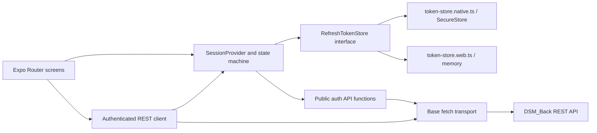

# Front Secure Session and REST API Client Design

- **Date:** 2026-07-25
- **Status:** Approved for detailed planning; product implementation is not yet approved
- **Target:** `DSM_Front` Expo SDK 55 and the minimum supporting `DSM_Back` auth changes
- **Decision:** Lightweight `fetch` client plus an explicit session state machine

## 1. Background

`DSM_Front` is currently a UI prototype. Login is simulated locally, task data is local, and there is no production OAuth exchange, REST client, token persistence, session recovery, or backend-driven onboarding state.

`DSM_Back` already provides:

- `POST /auth/login`
- `POST /auth/refresh`
- `POST /auth/logout`
- `GET /auth/me`
- 15-minute access tokens
- 30-day rotating refresh tokens in `<recordId>.<secret>` form
- single-winner refresh rotation in a database transaction

The next product milestone needs a secure native session foundation before notification client work begins. The Web target is only for UI development and QA, so it must not weaken native token storage policy.

## 2. Goals

- Keep access tokens only in process memory.
- Persist refresh tokens securely on iOS and Android.
- Keep Web sessions memory-only so a reload intentionally signs the user out.
- Provide a typed, runtime-validated REST client using the platform `fetch` implementation.
- Recover native sessions through refresh-token rotation at application bootstrap.
- Coalesce concurrent refresh attempts into one request.
- Prevent stale login or refresh work from restoring a session after logout.
- Preserve the session during recoverable offline bootstrap failures.
- Fail closed for invalid credentials, malformed auth responses, and secure-storage failures.
- Store first-onboarding completion globally on the user account.
- Restrict browser CORS to an explicit allowlist without blocking Native or CLI requests that have no `Origin`.
- Establish automated Front testing and linting compatible with Expo SDK 55 and React 19.

## 3. Non-goals

- Google or Kakao provider-token acquisition SDK integration.
- Apple provider verification.
- A development-only authentication bypass or hard-coded provider token.
- Task, Category, Ranking, notification, or WebSocket API integration.
- FCM registration, notification permission, or account-switch Installation rotation.
- Cookie-based authentication.
- Background refresh while the application is inactive.
- Silent recovery from a refresh response that the server completed but the client never received.
- Production deployment, remote database migration, or real-provider OAuth end-to-end verification.

The session API will expose `signIn(provider, providerToken)`, but a product login button cannot call it until the separate provider-token acquisition milestone is implemented. Unit and integration tests will exercise this interface with mocked provider exchange responses.

## 4. Selected Approach

### 4.1 Decision

Use a small internal REST client based on `fetch` and an explicit React session provider/state machine.

### 4.2 Why this approach

- The current API surface is small and does not need Axios interceptors or a query cache.
- Token rotation and logout ordering are easier to reason about when session transitions are explicit.
- It avoids adding a general-purpose data-fetching dependency before Task and Ranking integration requirements are known.
- Authentication behavior remains independently testable through injected transport and token-store dependencies.

### 4.3 Rejected alternatives

#### Axios with interceptors

This is familiar but adds a dependency and makes refresh recursion, public-endpoint exclusion, and retry boundaries easier to hide inside interceptor ordering.

#### TanStack Query as the session owner

TanStack Query may be useful for later server-state caching, but it should not own refresh-token persistence or authentication transitions. Adding it now would couple session work to an unapproved data-cache architecture.

#### Persistent browser storage

`localStorage`, `sessionStorage`, IndexedDB, and browser cookies are excluded from this milestone. Web is a QA surface, and preserving browser sessions would create a larger threat model without product value.

## 5. System Architecture



The layers have one-way responsibilities:

- configuration validates the API base URL;
- the base transport performs HTTP, timeout, JSON, and protocol handling;
- public auth functions call login and refresh without automatic authentication;
- the authenticated client attaches the current access token and coordinates one refresh/replay;
- the token store only reads, writes, and deletes the refresh token;
- the session provider owns access-token memory, user identity, onboarding state, refresh coordination, and routing state;
- screens consume session actions and state without reading tokens.

## 6. Front Configuration

### 6.1 API base URL

The client reads `process.env.EXPO_PUBLIC_API_BASE_URL` with static dot notation.

Validation rules:

- the value is required;
- it must parse as an absolute `http:` or `https:` URL;
- embedded credentials, query strings, and fragments are rejected;
- production builds require `https:`;
- development builds may use `http:` only for loopback or private-network hosts needed by local devices;
- the normalized base URL has no trailing slash.

`EXPO_PUBLIC_` variables are compiled into the client bundle and are not secrets. No credential, provider secret, service-account value, or token may be stored in them.

Local machine overrides belong in ignored `.env*.local` files. A committed example may contain only placeholders.

### 6.2 Request defaults

- default timeout: 10 seconds;
- `Accept: application/json`;
- `Content-Type: application/json` only when a JSON body exists;
- no cookies and no `credentials: include`;
- no automatic retry for mutations, login, refresh, or network timeouts;
- no token, provider token, request `Authorization` header, or response token logging.

## 7. Token Storage

### 7.1 Storage contract

```ts
interface RefreshTokenStore {
  read(): Promise<string | null>;
  write(refreshToken: string): Promise<void>;
  clear(): Promise<void>;
}
```

The implementation uses platform-specific module resolution:

- `token-store.native.ts` imports `expo-secure-store`;
- `token-store.web.ts` keeps one module-local in-memory value;
- shared code never imports SecureStore directly.

### 7.2 Native policy

- storage key: a versioned non-secret identifier such as `dsm.auth.refresh-token.v1`;
- logout tombstone: a versioned non-token marker recognized as an empty store;
- asynchronous SecureStore APIs only;
- default iOS `WHEN_UNLOCKED` accessibility;
- `requireAuthentication: false`;
- SecureStore config plugin enabled in the Expo app config;
- Android backup handling left to the SecureStore config plugin unless the project later adds a custom backup policy;
- storage unavailability, read failure, write failure, and delete failure are surfaced as `storage` errors.

The refresh token validator applies a conservative size limit before storage. Access tokens must be non-empty and no larger than 16 KiB; refresh tokens must be non-empty, contain the record/secret separator, and be no larger than 1 KiB. The expected refresh token is much smaller, but the bound prevents an invalid backend response from becoming an oversized SecureStore write.

Every native operation is treated as fallible. `clear()` first deletes and verifies absence. If deletion fails or the value remains, it overwrites the same key with the logout tombstone and verifies that marker. `read()` treats the tombstone as no token. If neither deletion nor tombstone replacement can be verified, the session enters a blocking storage-error state instead of claiming that persistent credentials were removed.

### 7.3 Web policy

- refresh token exists only in JavaScript memory;
- page refresh, tab close, or process restart removes the token;
- `localStorage`, `sessionStorage`, IndexedDB, and cookies are not fallback stores;
- a Web reload returns to the unauthenticated route by design.

### 7.4 Serialized mutation queue

All token-store writes, deletes, and logout's combined read-and-clear operation run through one serialized mutation queue owned by the session layer.

Each session-changing operation captures a monotonically increasing `sessionEpoch`. A queued write commits only if its captured epoch still matches the current epoch.

Logout increments the epoch synchronously before its read-and-clear operation is queued. The queued critical section captures whichever refresh token is current at that point and then clears it before releasing the queue. This guarantees:

- a queued stale write is skipped;
- a write already in progress is followed by logout's queued read-and-clear;
- a stale operation cannot delete a newer session because it never performs an unconditional cleanup outside the same queue;
- login, refresh, and logout store mutations have one deterministic order.

## 8. API Contracts

### 8.1 Existing login

`POST /auth/login`

```json
{
  "provider": "GOOGLE",
  "token": "<provider-token>"
}
```

Google receives an ID token. Kakao receives an access token. Provider-token acquisition remains outside this design.

### 8.2 Existing refresh

`POST /auth/refresh`

```json
{
  "refreshToken": "<recordId>.<secret>"
}
```

### 8.3 Token response

Login and refresh return:

```json
{
  "accessToken": "<jwt>",
  "refreshToken": "<recordId>.<secret>"
}
```

The Front validates both fields at runtime for type, non-empty content, contract form, and the size bounds in section 7.2 before accepting either token.

### 8.4 Expanded current user

`GET /auth/me`

```json
{
  "userId": "<uuid>",
  "onboardingCompletedAt": null
}
```

or:

```json
{
  "userId": "<uuid>",
  "onboardingCompletedAt": "2026-07-25T12:34:56.000Z"
}
```

The Front validates:

- `userId` is a non-empty string;
- `onboardingCompletedAt` is `null` or a valid ISO timestamp string.

### 8.5 Complete onboarding

`PATCH /auth/me/onboarding`

- requires the access token;
- has no client-supplied completion timestamp;
- performs an idempotent conditional update only while the database value is null;
- preserves the first canonical server timestamp during concurrent requests;
- returns `200` with the same current-user response shape.

### 8.6 Existing logout

`POST /auth/logout`

```json
{
  "refreshToken": "<recordId>.<secret>"
}
```

It requires the current access token and returns `204`.

## 9. Backend Data Model and CORS

### 9.1 User model

Add:

```prisma
onboardingCompletedAt DateTime? @db.Timestamptz(6)
```

The field is nullable for all existing users. No index is required because it is read and updated by user primary key.

### 9.2 Onboarding update

Within the authenticated user's scope:

1. call `updateMany` with `id = current user` and `onboardingCompletedAt = null`;
2. write the server's current UTC timestamp;
3. read and return the canonical user projection.

Concurrent calls are safe because only one conditional update can change the null field. Later calls return the already stored timestamp.

### 9.3 CORS

Add `CORS_ORIGINS` as a comma-separated browser-origin allowlist.

Rules:

- trim entries and ignore empty entries;
- compare complete origins exactly, including scheme and port;
- allow requests with no `Origin` so Native applications, server-to-server clients, and CLI tests continue to work;
- do not reflect arbitrary browser origins;
- set `credentials: false`;
- do not use wildcard origins;
- explicitly allow the application methods and the `Authorization` and `Content-Type` request headers;
- include local Expo Web origins explicitly in local environment configuration.

Native application security continues to rely on API authentication and authorization. CORS is only a browser enforcement mechanism.

## 10. REST Client Behavior

### 10.1 Base transport

The base transport:

1. resolves an endpoint against the validated base URL;
2. creates an `AbortController` timeout;
3. sends only JSON-compatible bodies in this milestone;
4. reads response text once;
5. accepts empty content for `204`;
6. parses expected JSON;
7. converts invalid or unexpected response shapes into a protocol error;
8. clears the timeout in `finally`.

Request bodies are limited to replayable JSON values. Streams, blobs, multipart forms, and `FormData` are outside this client phase so a single replay is deterministic.

### 10.2 Public auth functions

Login and refresh use the base transport directly. They never pass through the authenticated client and never trigger recursive refresh.

### 10.3 Authenticated requests

The authenticated client:

1. asks the session for the current in-memory access token;
2. attaches `Authorization: Bearer <token>`;
3. executes the request;
4. returns immediately for every result other than `401`;
5. on the first `401`, joins or starts the session's single refresh operation;
6. replays the original request once after refresh succeeds;
7. never refreshes or replays a second time.

Network errors and timeouts are not treated as authentication failures.

### 10.4 Single-flight refresh

The session stores one in-flight refresh promise. Concurrent callers receive the same promise.

The refresh operation:

1. captures the current epoch;
2. reads the stored refresh token;
3. calls the public refresh endpoint once;
4. validates the token response;
5. queues the rotated refresh-token write under the captured epoch;
6. publishes the access token only after the store commit succeeds and the epoch still matches;
7. clears the in-flight promise in `finally`.

A missing refresh token or refresh `401` ends the current session. A network or timeout failure preserves the existing local refresh token and produces a recoverable offline/error result.

If the rotated token cannot be stored, or the epoch changed before it could be committed, the client does not publish the new access token. It attempts one server logout using the newly issued pair and then clears the current local session. This cleanup is best-effort and never deletes a newer session's token.

No automatic refresh retry is allowed. With single-use rotation, a response can be lost after the server commits rotation. Retrying the old token cannot reliably distinguish that case from token theft or another client race.

## 11. Session State Machine

### 11.1 Stable states

```ts
type SessionState =
  | { status: 'bootstrapping' }
  | { status: 'offline'; retry: 'bootstrap' | 'profile' }
  | { status: 'storage-error'; operation: 'read' | 'write' | 'clear' }
  | { status: 'unauthenticated' }
  | {
      status: 'onboarding';
      userId: string;
      onboardingCompletedAt: null;
    }
  | {
      status: 'authenticated';
      userId: string;
      onboardingCompletedAt: string;
    };
```

Transient action flags such as `signingIn`, `refreshing`, `completingOnboarding`, and `loggingOut` may be exposed separately so stable routing state does not multiply into unnecessary combinations.

### 11.2 Bootstrap

1. Start in `bootstrapping`.
2. Read the refresh token.
3. If absent, move to `unauthenticated`.
4. If present, perform one refresh rotation.
5. Persist the rotated refresh token before publishing the access token.
6. Call `GET /auth/me`.
7. Route to `onboarding` when the timestamp is null.
8. Route to `authenticated` when the timestamp is present.

Failure policy:

- token-store read failure: attempt verified clear/tombstone, then enter `unauthenticated` only on success; otherwise enter blocking `storage-error`;
- refresh `401`: clear local credentials and move to `unauthenticated`;
- refresh network/timeout: preserve the refresh token and move to `offline`;
- malformed token or user response: best-effort revoke when possible, clear local credentials, and move to `unauthenticated`;
- `/auth/me` network/timeout after a successful refresh: keep the rotated refresh token and in-memory access token, move to `offline`, and retry profile fetch without forcing a new refresh unless the access token later receives `401`.

### 11.3 Sign in

`signIn(provider, providerToken)`:

1. increments the epoch to invalidate earlier authentication work;
2. calls `POST /auth/login`;
3. validates the response;
4. queues the refresh-token write under the captured epoch;
5. publishes the access token only after storage succeeds;
6. loads `GET /auth/me`;
7. enters `onboarding` or `authenticated`.

If refresh-token storage fails after the server issued a pair, the client uses the newly issued access and refresh tokens to attempt one server logout, clears local state, and remains unauthenticated only after verified clear/tombstone. If local cleanup cannot be verified it enters `storage-error`. If the network prevents revocation, the server refresh token can remain valid until its 30-day expiry.

Provider tokens exist only for the exchange call and are never persisted or logged.

### 11.4 Complete onboarding

`completeOnboarding()`:

1. is available only in the `onboarding` state;
2. calls `PATCH /auth/me/onboarding`;
3. validates the canonical response;
4. enters `authenticated` using the returned timestamp;
5. remains on the tutorial with a retryable error on network/timeout failure;
6. delegates `401` handling to the authenticated client.

This makes the tutorial account-global across devices.

### 11.5 Logout

Logout is local-first and server-best-effort:

1. capture the current access token synchronously;
2. increment the epoch synchronously before any asynchronous storage work;
3. clear the in-memory access token and user state;
4. queue one storage critical section that reads the current refresh token and performs verified clear/tombstone;
5. move to `unauthenticated` when local cleanup succeeds, or blocking `storage-error` when it cannot be verified;
6. attempt `POST /auth/logout` once using the captured access token and the refresh token returned by the storage critical section, without triggering refresh;
7. discard server network, timeout, `401`, and protocol failures after making them available to diagnostics without token data.

Local logout succeeds when offline as long as local storage cleanup succeeds. The accepted consequence is that a server refresh token may remain active until expiry. A physical storage failure is never reported as successful credential deletion; the blocking recovery screen offers local cleanup retry.

## 12. Error Model

```ts
type ApiErrorKind =
  | 'network'
  | 'timeout'
  | 'http'
  | 'unauthorized'
  | 'protocol'
  | 'storage';
```

`ApiError` contains:

- `kind`;
- a safe user-facing or diagnostic message;
- optional HTTP status;
- optional sanitized backend error code or request identifier;
- optional cause for local debugging.

It must not contain:

- access or refresh tokens;
- provider tokens;
- `Authorization` headers;
- raw request bodies for auth endpoints;
- complete backend response bodies that have not been sanitized.

Policy matrix:

| Failure | Session action | Token action | UI |
|---|---|---|---|
| Bootstrap network/timeout | Preserve | Preserve | Offline retry |
| Authenticated request network/timeout | Preserve | Preserve | Per-screen retry |
| Refresh `401` | End session | Clear | Login |
| Replayed request `401` | End session | Clear | Login |
| Auth response protocol error | End session | Clear/revoke best-effort | Login + safe error |
| SecureStore read/write failure | Fail closed | Verified clear/tombstone | Login or blocking storage recovery |
| SecureStore clear failure | End in-memory session | Tombstone fallback; retry if unverified | Blocking storage recovery |
| Logout server failure | End local session | Clear local | Login |
| Onboarding network/timeout | Preserve onboarding | Preserve | Tutorial retry |

## 13. Routing

Expo Router protected routes map stable states to one active route set:

- `bootstrapping`: splash/loading surface only;
- `offline`: session recovery retry screen;
- `storage-error`: blocking local credential-cleanup retry screen;
- `unauthenticated`: login route;
- `onboarding`: tutorial route;
- `authenticated`: tab routes.

Each screen is declared exactly once. Guard transitions remove inaccessible route history, so logout cannot navigate back into a protected screen.

Protected routes are a client-navigation boundary, not backend authorization. Every protected backend endpoint continues to enforce JWT authentication and user ownership.

## 14. Testing Strategy

### 14.1 Front test foundation

- `jest-expo` preset;
- Jest and TypeScript Jest types;
- React Native Testing Library;
- no `react-test-renderer` because the project uses React 19;
- explicit Expo SDK 55 Flat ESLint configuration based on `eslint-config-expo`;
- deterministic fake transport, fake clock where needed, and fake token stores.

### 14.2 Token-store tests

- native adapter delegates read/write/delete to SecureStore with the versioned key;
- native failures are converted to storage errors;
- failed deletion falls back to a verified logout tombstone;
- Web adapter persists within one module lifetime only;
- Web has no browser-storage access;
- serialized writes and deletes preserve order;
- logout prevents a late refresh write from resurrecting a token;
- a stale operation cannot delete a newer login's token.

### 14.3 REST-client tests

- validated base URL construction;
- missing/invalid/unsafe production base URL rejection;
- JSON and `204` parsing;
- timeout and network classification;
- malformed JSON and response-shape protocol errors;
- no mutation retry after timeout;
- no recursive refresh for login/refresh;
- N concurrent `401` responses produce one refresh request;
- each original request replays at most once;
- refresh `401` clears the session;
- refresh network failure preserves credentials;
- logs and serialized errors contain no token material.

### 14.4 Session tests

- missing refresh token bootstraps to unauthenticated;
- valid refresh and completed onboarding bootstraps to authenticated;
- valid refresh and null onboarding bootstraps to onboarding;
- bootstrap network failure enters offline and retry recovers;
- SecureStore read/write failure fails closed;
- unverified SecureStore clear enters blocking recovery rather than reporting logout success;
- sign-in stores refresh before publishing access;
- failed sign-in storage performs best-effort revoke;
- concurrent refresh and logout end unauthenticated with an empty store;
- logout during login prevents the late login response from restoring the session;
- offline logout reaches unauthenticated when verified local cleanup succeeds;
- onboarding completion is retryable and uses the canonical server timestamp.

### 14.5 Backend tests

- `/auth/me` returns the expanded response;
- onboarding completion requires authentication;
- first onboarding completion writes a server timestamp;
- repeated and concurrent completion preserve one canonical timestamp;
- migration adds a nullable UTC timestamp and preserves existing users;
- configured browser origin receives CORS headers;
- unlisted browser origin does not receive CORS access;
- no-Origin Native/CLI request remains accepted;
- credentialed CORS is disabled.

### 14.6 Manual validation

- Web reload logs out intentionally.
- Web unauthenticated, loading, offline, and error screens render at existing QA sizes.
- iOS and Android real-device smoke verifies SecureStore write, process restart, session recovery, and logout deletion.
- SecureStore deletion-failure injection verifies tombstone fallback and blocking recovery when fallback also fails.
- No real provider OAuth end-to-end claim is made until provider SDK integration.

## 15. Implementation Order

The detailed implementation plan must divide work into exact one- or two-file edit stages:

1. backend user onboarding schema and migration;
2. backend current-user and onboarding service/controller behavior;
3. backend CORS configuration and tests;
4. Front dependency and test/lint configuration;
5. Front API base URL and error types;
6. native and Web refresh-token stores;
7. base transport and auth contract validators;
8. authenticated client and single-flight refresh coordination;
9. session provider and state transitions;
10. Expo Router guards and session screens;
11. tutorial completion and logout UI wiring;
12. complete automated and manual verification;
13. authentication/concurrency/database `change-gate`.

Each implementation stage requires separate product-code approval under the project memory protocol.

## 16. Completion Criteria

This milestone is complete only when:

- Native refresh tokens persist only in SecureStore and access tokens remain memory-only.
- Web has no persistent token mechanism and reload signs out.
- Session bootstrap, offline retry, rotation, one-time replay, onboarding, and logout follow the state machine.
- Concurrent `401` requests result in one refresh.
- Logout cannot be undone by a late login, refresh, or token-store write under an available token store.
- Local credential deletion is verified or the application remains in a blocking storage-recovery state.
- Account-global onboarding is persisted by the backend and returned by `/auth/me`.
- Browser CORS is exact-allowlist based and Native no-Origin requests still work.
- Front and Backend automated verification pass.
- the persistent development database applies the migration with zero drift.
- real-device SecureStore smoke passes on iOS and Android.
- the change-gate has no unresolved P0/P1 finding.

The following do not count as completion evidence:

- prototype timer login;
- browser local storage;
- mocked tests presented as real provider OAuth;
- an emulator-only SecureStore check;
- a static type assertion without runtime response validation.

## 17. Known Limitations and Follow-up

### 17.1 Lost refresh response

The backend revokes the old refresh token and creates the replacement in one transaction, but it stores only token hashes. If that transaction succeeds and the response is lost, the client cannot recover the replacement token and a later use of the old token returns `401`.

This milestone handles the ambiguity safely by not automatically retrying refresh. A future protocol may add a securely designed idempotency/recovery mechanism, but it requires a separate backend security design and migration.

### 17.2 Offline logout

Local logout succeeds offline, but the server token may remain usable until its 30-day expiry. This is an explicitly accepted product policy for this milestone.

### 17.3 Physical secure-storage failure

No application can guarantee deletion when the operating-system credential store rejects both deletion and replacement. The client uses verified deletion plus a tombstone fallback and refuses to report a clean logout if both fail. If the process is killed before storage recovers and the server could not revoke the token, a later bootstrap can still encounter the old token. Real-device failure handling and server-side revocation remain required defense in depth.

### 17.4 Existing accounts

The migration leaves `onboardingCompletedAt` null for existing accounts because there is no trustworthy historical completion signal. Those accounts see the tutorial once on their next successful login.

### 17.5 Provider login

The exchange interface is implemented and tested, but actual Google/Kakao acquisition and full login UI integration remain a separate milestone. No development bypass will be introduced implicitly.

## 18. Official References

- Expo SecureStore SDK 55: <https://docs.expo.dev/versions/v55.0.0/sdk/securestore/>
- Expo Router protected routes: <https://docs.expo.dev/router/advanced/protected/>
- Expo environment variables: <https://docs.expo.dev/guides/environment-variables/>
- Expo unit testing with Jest: <https://docs.expo.dev/develop/unit-testing/>
- Expo ESLint configuration: <https://docs.expo.dev/guides/using-eslint/>
