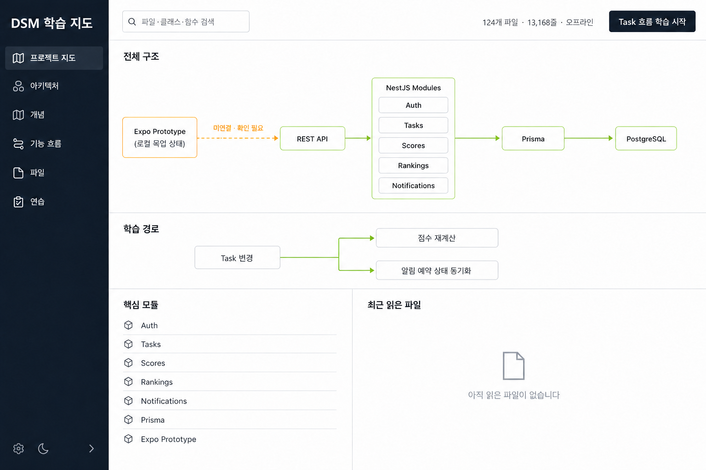
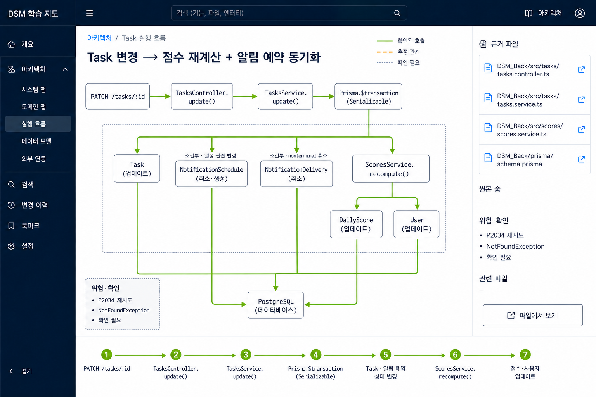
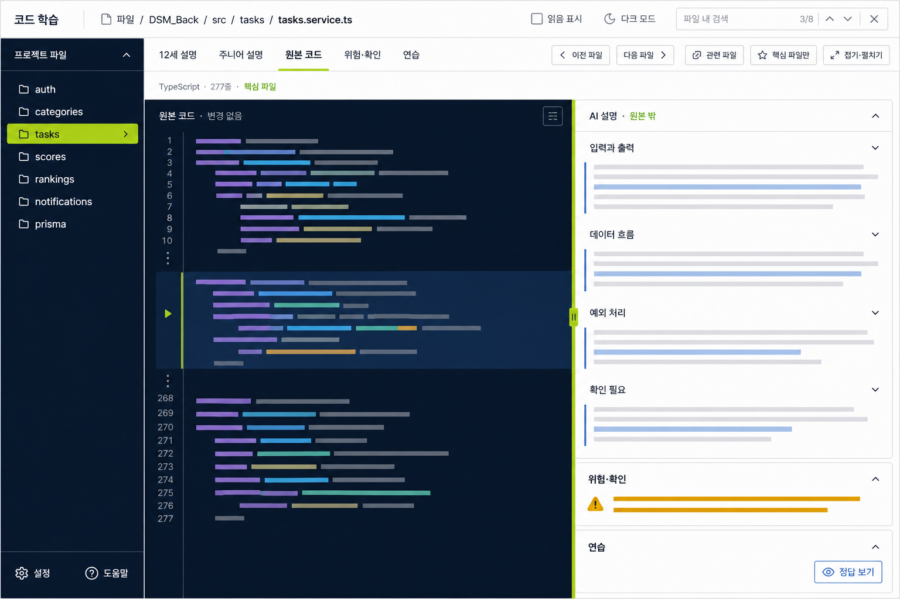
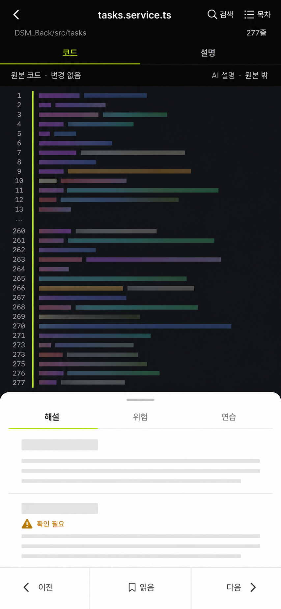

# DSM 오프라인 학습 사이트 디자인 명세

- 상태: 2026-08-08 사용자 `명세 승인`으로 승인 완료, 상세 구현 계획 승인 대기
- 작성일: 2026-08-08
- 원본 기준: `C:\DEV`, branch `codex/m12b-front-prototype-checkpoint`, commit `960f02b`
- 조사 기준: application text 124개 파일·13,168줄
- 첫 생성 범위: Pilot A 15개 파일

## 1. 목적

이 사이트는 DSM 저장소의 원본 소스 코드를 수정하거나 생략하지 않고, 개발 1년 차 학습자가 구조·요청 흐름·트랜잭션·테스트 근거를 오프라인에서 따라갈 수 있게 만든 정적 다중 페이지 학습 자료다. 모든 페이지는 서버 없이 `file://`로 열려야 하며, 설명과 다이어그램은 원본 코드와 명확히 분리한다.

핵심 성공 조건은 다음과 같다.

1. 원본 코드 영역은 HTML escape와 표시용 syntax token 분할 외에 어떤 문자도 바뀌지 않는다.
2. 학습자는 프로젝트 지도에서 기능 흐름을 고르고, 관련 파일·심볼·테스트를 앞뒤로 탐색할 수 있다.
3. 확인된 사실, 코드에서 합리적으로 추론한 관계, 아직 확인하지 못한 관계를 시각적으로 구분한다.
4. 데스크톱과 모바일에서 코드와 설명을 각각 읽기 좋은 방식으로 제공한다.
5. 생성 결과는 줄 수·바이트 해시·링크·검색·오프라인 동작 검증을 통과해야 한다.

## 2. 범위와 비범위

### 범위

- `DSM_Back` 88개 파일·8,787줄과 `DSM_Front` 36개 파일·4,381줄로 확정한 application text corpus
- 프로젝트 지도, 아키텍처, 핵심 개념, 기능 흐름, 파일 학습, 연습 페이지
- 파일 경로·클래스·함수 검색, 관련 파일, 이전/다음, 읽음 상태, 다크 모드
- 확인 근거가 있는 inline SVG 다이어그램과 확대·축소·이동
- 10~20개 원본 파일 단위의 배치 생성과 진행 현황 보고
- 첫 배치인 Pilot A 15개 파일

### 비범위

- 원본 application source, test, config의 수정·리팩터링·주석 삽입
- `DSM_Back/.env` 및 secret·token·credential 값의 읽기·복사·노출
- `.git`, `.worktrees`, `node_modules`, `dist`, `.expo`, lock file, media/binary의 코드 페이지 생성
- 외부 CDN, 원격 font, runtime network fetch, 서버 의존 기능
- 실제 제품 동작 변경, backend 또는 Expo 앱 연동
- Pilot A에서의 실제 FCM 발송과 `NotificationsService` 호출 경로 설명
- 코드에 없는 모듈·호출·설정·사실의 창작
- 별도 worktree를 원본 corpus에 중복 포함

## 3. 승인된 시각 콘셉트

시각 방향은 **technical field notebook + code evidence map**이다. 흰 학습 면, 짙은 잉크색 탐색·코드 면, 확인 관계의 라임색, 추론·확인 필요 관계의 앰버색, 차분한 회색 경계를 사용한다.

### 3.1 프로젝트 지도



### 3.2 Task 아키텍처



### 3.3 데스크톱 파일 학습



### 3.4 모바일 파일 학습



위 이미지의 source-like 색 막대와 생성 이미지의 줄 번호는 레이아웃 참고일 뿐 원본 코드나 사실 명세가 아니다. 실제 구현에서는 generator가 root source를 읽어 코드, 줄 번호, 파일 크기와 심볼을 만든다. 이미지와 원본이 충돌하면 원본과 이 문서의 사실 계약이 우선한다. 원본 소스 내용은 이미지 생성 서비스에 전송하지 않았다.

## 4. 정보 구조

정적 출력 구조는 다음과 같다.

```text
learning-site/
├─ index.html                 # 프로젝트 지도와 학습 시작점
├─ architecture.html          # 전체·기능별 아키텍처
├─ concepts/                  # 개념 설명
├─ features/                  # 요청·상태 변화별 기능 흐름
├─ files/                     # 원본 파일 학습 페이지
├─ exercises/                 # 연습과 접힌 해설
├─ diagrams/                  # 독립 다이어그램 페이지
└─ assets/                    # local CSS, JS, icons, search data
```

모든 내부 URL과 asset 경로는 정적 파일 기준 상대 경로다. routing server, history API fallback 또는 HTTP fetch가 없어도 이동해야 한다.

### 4.1 전역 탐색과 고정 카피

- 브랜드: `DSM 학습 지도`
- 주 탐색: `프로젝트 지도`, `아키텍처`, `개념`, `기능 흐름`, `파일`, `연습`
- 검색 입력 안내 문구: `파일·클래스·함수 검색`
- 범위 요약: `124개 파일 · 13,168줄 · 오프라인`
- 첫 CTA: `Task 흐름 학습 시작`
- 홈 링크는 모든 페이지에서 키보드와 포인터로 접근 가능해야 한다.

### 4.2 파일 페이지 고정 카피

- 파일 메타 예시: `TypeScript · 277줄 · 핵심 파일`
- 탭: `12세 설명`, `주니어 설명`, `원본 코드`, `위험·확인`, `연습`
- 원본 영역 label: `원본 코드 · 변경 없음`
- 설명 영역 label: `AI 설명 · 원본 밖`
- 탐색·상태 control: `이전`, `다음`, `관련 파일`, `핵심 파일`, `접기`, `읽음`, `다크 모드`, `검색`
- 모바일 mode: `코드`, `설명`
- 모바일 목차: `이 파일에서 볼 것`

`277줄` 같은 수치는 `tasks.service.ts`의 현재 기준선 예시이며 하드코딩하지 않는다. 모든 파일 메타는 manifest에서 계산한다.

## 5. 홈과 프로젝트 지도

홈은 파일 목록보다 먼저 “무엇이 어디에 있고 어떻게 이어지는가”를 보여준다.

1. 상단 hero는 사이트 목적, corpus 범위, 오프라인 상태와 Pilot A CTA를 제공한다.
2. 프로젝트 지도는 `DSM_Front`와 `DSM_Back`을 나누고, NestJS → Prisma → PostgreSQL의 실제 backend 경로를 보여준다.
3. Expo Prototype의 현재 local mock과 REST API 사이에는 **점선 앰버** 연결과 `미연결 · 확인 필요` label을 사용한다. 실제 연결처럼 표현하지 않는다.
4. Pilot A 학습 경로는 Task 변경에서 `점수 재계산`과 `알림 예약 상태 동기화` 두 갈래로 분기한다.
5. 각 카드에는 관련 파일 수, 난이도, 예상 읽기 순서와 “왜 이 파일을 보는가”를 제공한다.

## 6. Pilot A의 사실 기반 아키텍처

Pilot 이름은 **Task 변경 → 점수 재계산 + 알림 예약 상태 동기화**다.

### 6.1 update 요청의 확인된 경로

```text
PATCH /tasks/:id
  → TasksController.update()
  → TasksService.update()
  → Prisma.$transaction (Serializable)
      ├─ Task update
      ├─ 일정 관련 변경 시 NotificationSchedule cancel/create
      ├─ 필요한 경우 NotificationDelivery cancel
      └─ ScoresService.recompute(transaction client)
           └─ DailyScore/User 갱신
  → Prisma
  → PostgreSQL
```

- `TasksService`는 `NotificationsService`를 직접 호출하지 않는다.
- `NotificationsService`는 FCM token register/revoke 경계이며 Pilot A Task mutation의 직접 호출 경로가 아니다.
- 실제 FCM send·dispatcher는 이 흐름과 다이어그램에서 제외한다.
- create, update, remove, complete의 상세 분기는 각각 원본 method와 테스트 근거로 서술한다.
- schedule/delivery 변화는 mutation 종류와 일정 관련 변경 여부에 따른 **조건부 side effect**로 표시한다.
- 점수 재계산과 예약 상태 변경은 같은 Serializable transaction client를 공유한다.

### 6.2 관계의 증거 표기

- 확인됨: 실선 + 라임 accent + 근거 파일·심볼 링크
- 추론됨: 점선 + 앰버 accent + `추론` label과 추론 이유
- 미확인: 회색 점선 + `확인 필요` label
- 조건부 확인: 실선 + 조건 label, 예: `일정 변경 시`, `delivery 존재 시`

색만으로 의미를 전달하지 않는다. 선 종류, text label, legend를 함께 사용한다.

## 7. 파일 학습 페이지 구조

모든 파일 페이지는 다음 A–G 순서를 유지한다.

### A. 위치와 역할

breadcrumb, 언어, 실제 줄 수, 핵심/보조 분류, 파일 해시, 직접 관련된 기능을 표시한다.

### B. 먼저 볼 것

학습자가 이 파일에서 찾을 class, function, decorator, transaction boundary, test evidence를 3~6개로 요약한다.

### C. 원본 코드

원본을 보존한 dark code panel이다. line number, 심볼 anchor, 현재 설명과 연결된 범위 highlight를 제공한다. 복사 동작은 화면상의 원본 text만 복사한다.

### D. 설명

desktop에서는 코드 오른쪽의 white panel에 배치한다. `12세 설명`은 비유와 목적을, `주니어 설명`은 입력·출력·의존성·실패 경로를 설명한다. 원본 밖 설명임을 항상 표시한다.

### E. 관계와 근거

호출 전후 파일, 데이터 모델, 테스트와 다이어그램을 연결한다. 각 핵심 주장에는 근거 파일과 가능한 경우 심볼 또는 line anchor를 붙인다.

### F. 위험·확인

동시성, ownership, validation, error mapping, 보안, 아직 연결되지 않은 기능을 구분한다. 근거가 부족하면 단정하지 않고 `확인 필요`로 남긴다.

### G. 연습과 다음 단계

예측, 흐름 배열, 코드 찾기, 위험 찾기, 작은 수정 설계 문제를 제공한다. 답과 해설은 기본 접힘 상태이며 원본을 수정하지 않는다. 마지막에는 관련 파일과 이전/다음 순서를 제공한다.

## 8. 원본 보존 계약

### 8.1 manifest

각 source entry는 최소한 다음 정보를 가진다.

- root 기준 상대 경로
- language와 page slug
- 원본 byte 수와 SHA-256
- logical line 수와 line-ending 종류
- UTF-8 decode 결과
- 핵심/보조 분류와 batch 번호
- 추출된 class/function/test symbol
- 민감·제외 검토 상태

### 8.2 변환 규칙

- 원본 code에 적용하는 내용 변환은 HTML escaping뿐이다.
- syntax highlighting은 text node를 token으로 나눌 수 있지만 token text를 순서대로 합친 결과가 escaped 전 원문과 같아야 한다.
- code panel에 교육용 주석, 생략 기호, 재포맷, 자동 수정 또는 가상 code를 삽입하지 않는다.
- 설명·callout·다이어그램은 별도 DOM region과 label을 사용한다.
- 표시 줄 수는 실제 logical line 수에서 계산한다.
- 생성 후 code region text, logical lines, source SHA-256과 manifest를 verifier가 대조한다.

## 9. 정적 생성 구조

구현 단계의 기본 구성은 다음 세 파일에서 시작한다.

- `tools/learning-site/manifest.mjs`: corpus allowlist, 분류, metadata와 학습 순서
- `tools/learning-site/generate.mjs`: source read, escape, page·index·asset 생성
- `tools/learning-site/verify.mjs`: source↔output 보존, 링크, 검색 index, 배치 상태 검증

외부 package가 없어도 실행되는 Node.js built-in 기반을 우선한다. 검색 데이터는 `fetch()`가 필요한 JSON 대신 local script가 전역 data를 등록하는 방식으로 제공한다. 생성 결과에는 CDN 또는 remote URL이 없어야 한다.

진행 manifest는 `processed`, `remaining`, `missing`, `excluded`를 구분한다. `excluded`에는 경로와 공개 가능한 제외 사유만 기록하고 secret 값은 기록하지 않는다.

## 10. 검색과 상호작용

- 전역 검색은 path, filename, class, function을 대상으로 한다.
- 결과에는 종류, 경로, 관련 기능, 핵심/보조 표시가 포함된다.
- 필터는 backend/frontend, language, source/test, 읽음/미읽음, batch를 지원한다.
- 검색 결과와 관련 파일 링크는 `file://` 상대 경로로 이동한다.
- 이전/다음은 승인된 학습 순서를 따른다.
- 접기 상태, 읽음 상태와 theme은 localStorage에 저장한다.
- localStorage가 차단되면 현재 session 안에서만 동작하고 비차단 안내를 한 번 표시한다.
- 다크 모드는 code panel뿐 아니라 전체 surface 대비를 보장한다.
- diagram은 확대·축소·이동, 원래 크기 복귀와 keyboard control을 제공한다.
- 모든 interaction은 visible focus, semantic button/link, accessible name을 가진다.
- `prefers-reduced-motion`에서는 필수적이지 않은 motion을 제거한다.

## 11. 반응형 계약

### 데스크톱

- 파일 학습 화면은 기본 62% code / 38% explanation split이다.
- 좌우 panel은 독립 scroll이 아니라 페이지 맥락을 잃지 않는 sticky 설명 구조를 우선한다.
- 긴 path와 code line은 영역을 밀어내지 않고 적절히 scroll 또는 wrap 처리한다.

### 모바일

- 좁은 화면에서 desktop split을 축소해 억지로 유지하지 않는다.
- `코드` / `설명` mode switch로 한 번에 한 주 작업 면을 보여준다.
- 설명은 필요할 때 bottom sheet로 빠르게 열 수 있다.
- `이 파일에서 볼 것`은 sheet 형태의 목차로 제공한다.
- 하단에는 `이전` / `읽음` / `다음` sticky control을 둔다.
- touch target은 최소 44×44 CSS px이고, code는 가로 scroll을 허용한다.

## 12. 시각 시스템

### 색

- 학습 surface: `#FFFFFF`
- 전역 ink/navigation: `#101827`
- code surface: `#0B1020`
- 확인됨 accent: `#B9F34A`
- 추론·확인 필요 accent: `#F2A93B`
- border·secondary text: cool gray 계열

본문과 control은 WCAG AA 수준의 대비를 목표로 한다. 라임은 큰 면적의 본문색이 아니라 상태·선·badge·focus accent로 제한한다.

### 타이포그래피와 형태

- Korean UI/body: OS에 포함된 system sans stack
- code: local system monospace stack
- remote font download 금지
- 4px 기반 spacing scale, 8~14px radius, 1px cool-gray border
- shadow는 floating search, sheet, sticky control처럼 계층 구분이 필요한 곳에만 사용
- icon은 단순한 inline SVG를 사용하며 text label 또는 accessible name을 동반

## 13. 오류·실패 상태

- manifest 파일이 없거나 읽을 수 없으면 해당 batch 생성을 실패시키고 정확한 상대 경로를 보고한다.
- UTF-8로 안전하게 해석할 수 없는 파일은 임의 변환하지 않고 `excluded`로 보고하며 검토 전 page를 만들지 않는다.
- 민감 파일 또는 secret-like content 후보는 자동 공개하지 않고 제외·검토 상태로 남긴다.
- source SHA, 줄 수 또는 code text가 일치하지 않으면 verifier가 non-zero로 종료한다.
- 끊어진 내부 링크, 누락 search index, 중복 slug도 검증 실패다.
- JavaScript가 꺼진 경우 원본 code와 기본 navigation은 읽을 수 있어야 한다. 검색·상태 저장 같은 향상 기능만 비활성화한다.
- 설명 근거가 없으면 가상 설명으로 채우지 않고 `확인 필요`와 확인할 파일을 제시한다.

## 14. Pilot A 출력 범위

첫 배치는 다음 15개 파일을 한 학습 흐름으로 묶는다.

1. `DSM_Back/src/app.module.ts`
2. `DSM_Back/prisma/schema.prisma`
3. `DSM_Back/src/tasks/tasks.controller.ts`
4. `DSM_Back/src/tasks/tasks.service.ts`
5. `DSM_Back/src/tasks/dto/create-task.dto.ts`
6. `DSM_Back/src/tasks/dto/update-task.dto.ts`
7. `DSM_Back/src/scores/scores.policy.ts`
8. `DSM_Back/src/scores/scores.service.ts`
9. `DSM_Back/src/notifications/notifications.service.ts`
10. `DSM_Back/src/notifications/notification-schedule.constants.ts`
11. `DSM_Back/src/prisma/prisma.service.ts`
12. `DSM_Back/src/tasks/tasks.service.spec.ts`
13. `DSM_Back/src/scores/scores.service.spec.ts`
14. `DSM_Back/src/notifications/notifications.service.spec.ts`
15. `DSM_Back/test/app.e2e-spec.ts`

`notifications.service.ts`와 그 spec은 알림 token 경계와 Task 흐름의 비연결을 구분해 학습하기 위한 비교 근거다. 이를 Task service의 직접 의존성으로 그리지 않는다.

## 15. 연습 유형

- 요청 흐름 순서 맞추기
- controller와 service 책임 구분하기
- transaction 안팎의 작업 찾기
- 조건부 schedule/delivery side effect 예측하기
- score policy 계산 근거 찾기
- unit/e2e test가 보장하는 것과 보장하지 않는 것 구분하기
- 잘못 그린 호출선을 원본 근거로 수정하기

각 문제는 난이도, 관련 파일과 학습 목표를 표시한다. 답은 접힌 상태이며, 해설은 원본 line anchor와 연결한다.

## 16. 검증 전략

### 자동 검증

- HTML escaping과 상대 경로 mapping unit test
- symbol extraction의 대표 TypeScript·Prisma fixture test
- syntax token text 재결합 보존 test
- fixture corpus에 대한 generator integration test
- 모든 원본 page의 SHA-256·byte·logical line·code region 대조
- 모든 local link·asset·anchor 존재 확인
- search index의 path/class/function 검색과 중복 slug 확인
- `file://` 환경에서 remote dependency가 없는지 검사
- 배치 manifest의 processed/remaining/missing/excluded 합계 검사

### 브라우저·시각 검증

- in-app Browser에서 desktop과 mobile viewport 검증
- 홈, 검색, filter, breadcrumb, 이전/다음, 관련 파일, 읽음, dark mode 검증
- code/explanation mobile switch, bottom sheet와 44px touch target 검증
- diagram zoom/pan/reset과 keyboard 접근 검증
- JS 비활성 기본 읽기 경로와 localStorage 차단 fallback 검증
- 승인된 네 콘셉트와 screenshot을 나란히 비교하되 실제 source text가 concept artifact보다 우선함을 확인
- contrast, visible focus, reduced motion, heading/landmark 순서 검증

### 저장소 보존 검증

- 생성 전후 application source diff가 없는지 확인
- `.env`와 제외 경로가 output과 search data에 없는지 확인
- dependency 설치, network fetch, Git stage·commit·push가 발생하지 않았는지 확인

## 17. 완료 기준

Pilot A는 다음 조건을 모두 만족할 때만 승인 후보가 된다.

1. 15개 파일 page와 Pilot 기능 흐름, architecture, 연습이 생성된다.
2. 원본 code의 SHA-256, byte 수, logical line 수와 화면 code text가 모두 일치한다.
3. `NotificationsService` 또는 FCM send를 Task mutation의 직접 호출로 표시한 곳이 없다.
4. 확인·추론·미확인·조건부 관계가 색 외 label과 선 모양으로 구분된다.
5. 검색, filter, prev/next, 관련 파일, 읽음, dark mode와 diagram control이 `file://`에서 동작한다.
6. desktop과 mobile의 승인 레이아웃 계약을 충족한다.
7. broken link, missing asset, duplicate slug, source drift, 민감 파일 노출이 없다.
8. application source와 기존 dirty 문서를 수정하지 않는다.
9. 사용자에게 processed/remaining/missing/excluded와 검증 결과를 보고한다.

## 18. 구현 진입 게이트

이 문서는 승인된 시각 방향을 서면 계약으로 고정한 것이며 아직 구현 승인이 아니다. 사용자가 이 명세를 검토·승인한 뒤에만 별도의 TDD 기반 상세 구현 계획을 작성한다. 그 계획의 단계·writable allowlist와 검증 명령까지 다시 승인받기 전에는 `learning-site/`와 `tools/learning-site/`를 생성하지 않는다.
